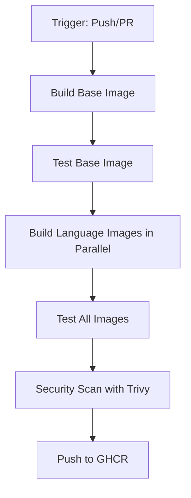

# GitHub Actions Setup for Container Images

This guide explains how the GitHub Actions workflow for building Reactor container images works and how to set it up in a fork or new repository.

## Current Setup (Already Configured)

The main Reactor repository **already has everything configured**. The workflow automatically:

- Builds all 4 official images (`base`, `python`, `node`, `go`) 
- Tests each image with comprehensive test suites
- Scans for security vulnerabilities with Trivy
- Publishes to GitHub Container Registry (GHCR)
- Supports multi-architecture builds (amd64/arm64)

## Workflow File Location

```
.github/workflows/build-images.yml
```

## Automatic Triggers

The workflow runs when:
- **Push to main**: Changes to `images/**` or workflow files
- **Pull Requests**: Changes to `images/**` or workflow files  
- **Manual**: Via GitHub Actions "Run workflow" button

## What It Does

### 1. Build Pipeline


### 2. Multi-Architecture Support
- Uses Docker Buildx for cross-platform builds
- Supports `linux/amd64` and `linux/arm64`
- Single manifest for both architectures

### 3. Security Integration
- Trivy vulnerability scanner on every image
- SARIF reports uploaded to GitHub Security tab
- Build fails on HIGH or CRITICAL vulnerabilities

### 4. Size Monitoring
- Tracks image sizes during build
- Warns if images exceed targets (base: 200MB, others: 500MB)
- Reports sizes in build summary

## Setting Up in Your Own Repository

If you fork Reactor or want to set up similar automation:

### 1. Repository Settings

**Enable GitHub Container Registry:**
```bash
# Go to Settings → Actions → General
# Set "Workflow permissions" to "Read and write permissions"
# Check "Allow GitHub Actions to create and approve pull requests"
```

**Package Settings:**
```bash
# Go to Settings → Actions → General  
# Under "Workflow permissions" ensure:
# ☑ Read and write permissions
# ☑ Allow GitHub Actions to create and approve pull requests
```

### 2. No Secrets Required

The workflow uses **built-in GitHub tokens**:
- `GITHUB_TOKEN`: Automatically provided by GitHub
- Has permissions to push to GitHub Container Registry
- No manual configuration needed

### 3. File Structure Required

Ensure your repository has:
```
.github/workflows/build-images.yml  # The workflow file
images/base/Dockerfile              # Base image definition
images/base/test.sh                 # Base image tests
images/python/Dockerfile            # Python image definition  
images/python/test.sh               # Python image tests
images/node/Dockerfile              # Node image definition
images/node/test.sh                 # Node image tests
images/go/Dockerfile                # Go image definition
images/go/test.sh                   # Go image tests
images/shared/entrypoint.sh         # Shared entrypoint script
```

### 4. Repository Variables (Optional)

You can customize behavior with repository variables:

```bash
# Go to Settings → Secrets and variables → Actions → Variables

# Optional variables:
REGISTRY=ghcr.io                    # Container registry (default)
IMAGE_NAME=reactor                  # Base image name (default)
```

## Monitoring Builds

### 1. GitHub Actions Tab
- View all workflow runs
- See build logs and test results
- Monitor success/failure rates

### 2. GitHub Security Tab
- View Trivy vulnerability scan results
- Track security issues over time
- Get alerts for new vulnerabilities

### 3. GitHub Packages
- View published container images
- Check download statistics
- Manage image tags and versions

## Customizing the Workflow

### 1. Changing Image Names
Edit the workflow file:
```yaml
env:
  REGISTRY: ghcr.io
  IMAGE_NAME: your-project-name  # Change this
```

### 2. Adding More Images
1. Create new directory: `images/new-image/`
2. Add `Dockerfile` and `test.sh`
3. Update workflow matrix:
```yaml
strategy:
  matrix:
    image: [python, node, go, new-image]  # Add here
```

### 3. Changing Size Limits
Update the matrix in the workflow:
```yaml
include:
  - image: python
    size_limit: 500  # Change this
```

### 4. Different Triggers
Modify the `on:` section:
```yaml
on:
  push:
    branches: [ main, develop ]  # Add more branches
  schedule:
    - cron: '0 6 * * 1'         # Weekly builds
```

## Troubleshooting

### Build Failures
Common causes and solutions:

1. **Permission Denied**
   ```
   Error: buildx failed with: ERROR: failed to push
   ```
   **Solution**: Check repository workflow permissions

2. **Image Too Large**
   ```
   Warning: Image size (600MB) exceeds target (500MB)
   ```
   **Solution**: Optimize Dockerfile or increase limit

3. **Test Failures**
   ```
   Error: Test script failed
   ```
   **Solution**: Check test script and image contents

4. **Security Scan Failures**
   ```
   Error: Trivy found HIGH severity vulnerabilities
   ```
   **Solution**: Update base packages in Dockerfile

### Debugging
```bash
# View workflow logs
gh run list --workflow=build-images.yml
gh run view <run-id> --log

# Test locally first
./scripts/build-images.sh --test
```

## Best Practices

1. **Always test locally** before pushing changes
2. **Use specific version pins** in Dockerfiles  
3. **Keep test scripts comprehensive** and up-to-date
4. **Monitor security scan results** regularly
5. **Update base images** monthly for security patches

## Advanced Configuration

### 1. Build Caching
The workflow uses GitHub Actions cache:
```yaml
cache-from: type=gha
cache-to: type=gha,mode=max
```

### 2. Matrix Builds
Parallel building using matrix strategy:
```yaml
strategy:
  matrix:
    image: [python, node, go]
```

### 3. Conditional Publishing
Only push on main branch:
```yaml
push: ${{ github.event_name != 'pull_request' }}
```

For additional questions or issues, create an issue in the repository.