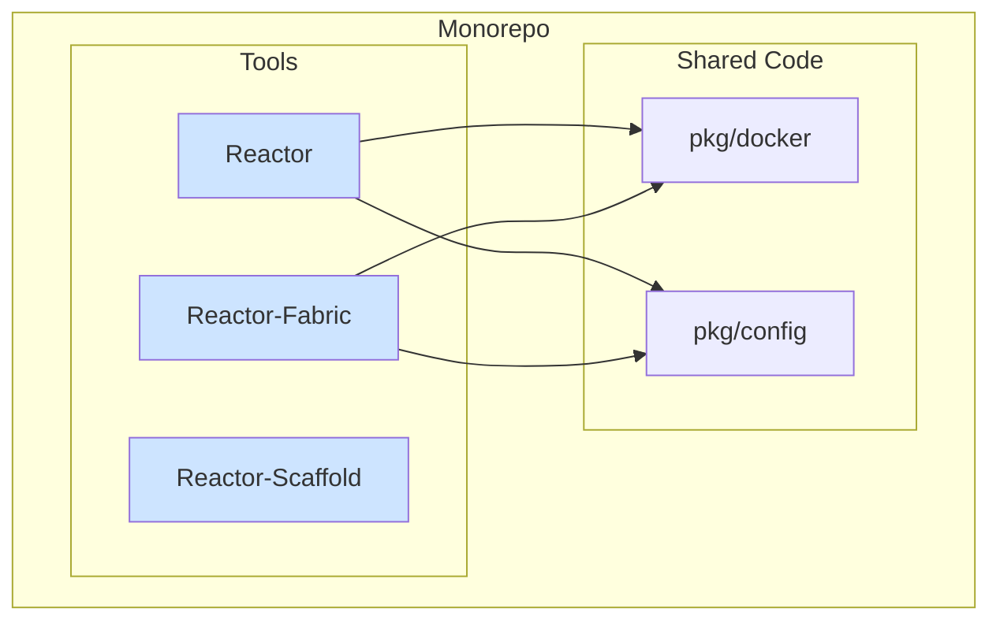

# **Project Charter: Reactor Suite Refactoring**

Version: 1.0  
Status: Final  
Author(s): Gemini, cam  
Date: 2025-08-23

## **1\. Project overview**

*This section serves as the executive summary. It defines the project's purpose, its intended outcome, and the core problem it solves. It is the "North Star" that guides all subsequent decisions.*

### **1.1. Vision statement**

To create a modular, extensible, and powerful ecosystem for AI-driven software development that is simple to use, easy to maintain, and agnostic to the underlying AI provider.

### **1.2. Mission statement**

We are refactoring the `claude-reactor` project into a modular suite of tools (`Reactor`, `Reactor-Fabric`, `Reactor-Scaffold`) to provide developers with a simple, provider-agnostic containerized environment and a powerful multi-agent orchestration system, enabling both streamlined daily workflows and complex, collaborative AI tasks.

### **1.3. Business goals & objectives**

*   **Goal 1: Increase Developer Velocity.** Provide a simple, fast, and secure environment (`Reactor`) that streamlines the day-to-day usage of AI CLI agents.
*   **Goal 2: Automate Complex Tasks.** Enable the automation of sophisticated development workflows (e.g., feature creation, bug fixing) by orchestrating multiple specialist AI agents (`Reactor-Fabric`) to overcome single-agent context window limitations.
*   **Goal 3: Foster Open Source Adoption.** Build a high-quality, easy-to-use toolset that attracts users and contributors from the open-source community.

## **2\. Strategic foundation**

*This section establishes the core principles and philosophies that will govern the project. It provides a framework for making consistent decisions and trade-offs.*

### **2.1. Guiding principles**

*   **Modularity over Monoliths:** The system will be composed of small, focused tools that do one thing well.
*   **Simplicity and Clarity:** We will favor simple, explicit solutions over complex, "magic" ones (e.g., no project auto-detection).
*   **User in Control:** The user should always have explicit control over their environment and tools.
*   **Extensibility by Design:** The architecture must be open to supporting new AI providers and tools without requiring a full rewrite.

### **2.2. Decision-making framework**

1.  **Maintainability & Stability:** The primary goal is to reduce complexity and create a stable foundation. Decisions will optimize for long-term health.
2.  **Developer Experience:** The tools must be simple and intuitive for developers to use in their daily workflows.
3.  **Extensibility:** The ability to support new providers and features is a key consideration.
4.  **Performance:** The tools should be fast and responsive, but not at the cost of clean architecture.

### **2.3. High-level success criteria**

*   **Velocity:** A developer can go from a clean project directory to an interactive AI session in a fully configured container in under 90 seconds.
*   **Collaboration:** Successfully demonstrate an end-to-end workflow where at least two distinct AI agents collaborate via `Reactor-Fabric` to implement and verify a code change.
*   **Adoption:** Achieve 100 stars on GitHub and receive contributions from at least 5 non-core developers within 6 months of public launch.

## **3\. Technical foundation**

*This section outlines the core technical strategy, architecture, and standards that will ensure the project is built in a consistent, scalable, and maintainable way.*

### **3.1. Core technology stack**

*   **Language:** Go (chosen for its performance, simplicity, strong concurrency model, and suitability for CLI tools).
*   **CLI Framework:** Cobra (a popular and robust framework for building modern Go CLIs).
*   **Containerization:** Docker (the project is fundamentally a tool for managing Docker containers).
*   **Docker SDK:** The official Docker SDK for Go will be used for all container interactions.

### **3.2. High-level component architecture**

The project is a monorepo that produces three distinct binaries:

*   **`Reactor`:** A CLI tool for managing single, containerized developer environments.
*   **`Reactor-Fabric`:** A standalone server for orchestrating a suite of AI agents (MCP services).
*   **`Reactor-Scaffold`:** A CLI tool for generating new projects from templates.
*   **`pkg/`**: Shared Go packages (e.g., Docker utilities, configuration models) used by the different tools.

### **3.3. Architectural principles**

*   **Monorepo:** All tools will be developed in a single repository to simplify dependency management and code sharing.
*   **Explicit Internal Boundaries:** Each tool will be composed of clearly defined internal layers (`cmd`, `core`, `docker`, `session`) to ensure high cohesion and low coupling.
*   **Configuration as Code:** All project and suite configurations will be managed in simple, version-controllable YAML files.
*   **Provider-Agnostic Design:** The `Reactor` tool will be designed to support multiple AI providers through a plugin-like configuration system.

### **3.4. Coding standards & conventions**

*   **Linting:** `golangci-lint` with a default configuration will be used to enforce code quality.
*   **Formatting:** `gofmt` is non-negotiable. All code will be formatted before commit.
*   **Naming Conventions:** Standard Go conventions will be followed.

## **4\. Execution framework**

*This section defines the processes and quality gates that govern how work is delivered.*

### **4.1. Definition of done (DoD)**

A feature is **done** only when it:

*   \[x\] Meets all acceptance criteria defined in its design document.
*   \[x\] Has comprehensive unit and integration tests with > 90% code coverage.
*   \[x\] Passes all CI/CD pipeline checks, including linting and formatting.
*   \[x\] Has been documented for end-users (if applicable) and for developers in the `docs/` directory.
*   \[x\] Has been peer-reviewed and approved.

### **4.2. Development workflow**

Development will follow a trunk-based development model. All work will be done on short-lived feature branches that are merged directly into `main` after a successful Pull Request review.

### **4.3. Team & communication**

*   **Primary Channel:** Asynchronous communication via GitHub Issues and Pull Requests is preferred.
*   **Source of Truth:** This Project Charter and the code itself are the ultimate sources of truth.

## **5\. Decision log**

*This section is a living appendix used to record significant architectural decisions, changes in strategy, or important learnings over the project's lifetime.*

*   **2025-08-23: Decision to Refactor the Monolith**
    *   **Context:** The original `claude-reactor` tool was becoming too complex by serving two different purposes (single dev environment vs. multi-agent orchestration).
    *   **Justification:** A modular approach with three distinct tools (`Reactor`, `Reactor-Fabric`, `Reactor-Scaffold`) will improve maintainability, developer experience, and extensibility.
    *   **Impact:** The project is being restructured into a multi-command monorepo.

*   **2025-08-23: Decision to Remove Auto-Detection**
    *   **Context:** The original design included "smart" auto-detection of project types.
    *   **Justification:** This adds complexity and violates the "User in Control" principle. An explicit `--image` flag is simpler and more reliable.
    *   **Impact:** The core logic of `Reactor` is simplified, requiring the user to specify their desired environment on the first run.
