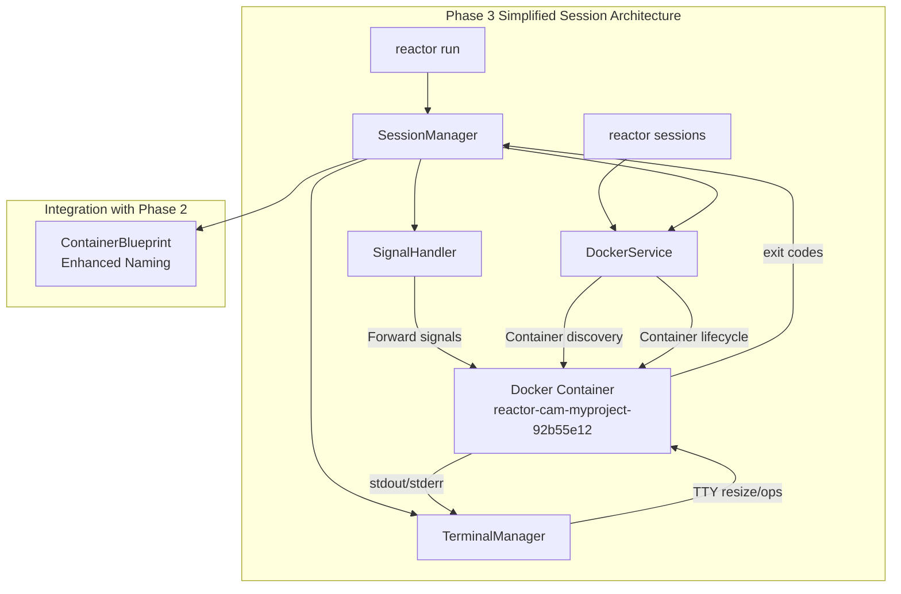

# **Feature Design Document: Phase 3 - Interactive Session Management**

Version: 1.0  
Status: Draft  
Author(s): Claude, cam  
Date: 2025-08-25

## **1. The 'Why': Rationale & User Focus**

*This section defines the purpose of Phase 3, building upon the successful Phase 2 container provisioning to deliver a seamless, production-quality interactive session experience.*

### **1.1. High-level summary**

Phase 3 enhances Reactor's interactive session capabilities with professional-grade terminal management, signal forwarding, and simple session discovery through enhanced container naming. While Phase 2 delivered functional container provisioning with basic session attachment, Phase 3 elevates the user experience to match modern development tools - providing robust terminal handling and intuitive session management that developers expect from production tools, all without additional complexity or state files.

### **1.2. User personas**

* **Primary Persona: The Productive Developer (\"Dev\")**: A software engineer who spends hours in interactive AI sessions for code development, debugging, and analysis. They need seamless session management with proper terminal resizing, signal forwarding, and the ability to reconnect to existing sessions without losing context.

* **Secondary Persona: The Multi-Project Developer (\"Multi-Dev\")**: A developer working on multiple projects simultaneously who needs to quickly switch between different Reactor sessions, reattach to backgrounded sessions, and manage multiple concurrent AI agent interactions across different project contexts.

### **1.3. Problem statement & user stories**

**Problem Statement:**
Phase 2 provided functional container provisioning and basic session attachment, but the interactive experience lacks the robustness and polish that developers expect from modern development tools. Users experience issues with terminal resizing, signal handling, and difficulty identifying and reconnecting to existing containers across multiple projects. This creates friction in their daily workflow and reduces confidence in Reactor as a production tool.

**User Stories:**

* As a **Dev**, I want my terminal to resize properly when I change my window size during an AI session, so that my development workflow isn't disrupted by display formatting issues.
* As a **Dev**, I want Ctrl+C and other signals to work correctly in my AI session, so that I can interrupt running processes and maintain normal terminal behavior expectations.
* As a **Multi-Dev**, I want to easily identify and reconnect to existing containers across different projects, so that I can quickly switch contexts without losing my work or having to restart containers.
* As a **Dev**, I want simple session discovery and reconnection using recognizable container names, so that I can recover from interruptions without complex session management.

### **1.4. Success metrics**

**Business Metrics:**

* **Developer Satisfaction**: Achieve 90% positive feedback on session management in user surveys within 2 months of Phase 3 release
* **Session Reliability**: Reduce session-related support issues by 80% compared to Phase 2 baseline
* **Adoption Stickiness**: Increase daily active usage retention by 40% due to improved session experience

**Technical Metrics:**

* **Terminal Responsiveness**: TTY resize events must be handled within 100ms, and signal forwarding must have <50ms latency
* **Container Discovery Speed**: Container listing and reconnection must complete within 2 seconds
* **Session Stability**: 99.5% success rate for terminal operations and container attachment under normal conditions
* **Resource Efficiency**: Enhanced terminal management must not exceed 2MB RAM overhead per active session

## **2. The 'How': Technical Design & Architecture**

*This section details the enhanced session management architecture building upon Phase 2's container provisioning foundation.*

### **2.1. System context & constraints**

* **Technology Stack**: Go 1.23+, Docker Go SDK v25.0.0+, enhanced terminal handling with github.com/moby/term, signal forwarding with os/signal
* **Current State**: Phase 2 implemented complete container provisioning with basic session attachment via `AttachInteractiveSession`. The current implementation handles basic TTY setup and stdin/stdout forwarding but lacks advanced session management features
* **Technical Constraints**: 
  * Must maintain compatibility with Phase 2's container lifecycle management
  * Limited by Docker API capabilities for session persistence
  * Terminal handling must work across macOS and Linux with different terminal emulators
  * Cannot require additional daemon processes or background services

### **2.2. Guiding design principles**

* **Reliability First**: Session management must be more reliable than basic Docker attach, with automatic recovery from common failure scenarios
* **Seamless Integration**: All session enhancements must integrate transparently with existing Phase 2 container provisioning without breaking changes
* **Progressive Enhancement**: Basic functionality from Phase 2 continues to work while new features add value without complexity for simple use cases
* **Resource Conscious**: Session management features must not significantly increase resource usage or startup time

### **2.3. Alternatives considered**

**Option 1: Enhanced Container Naming with Docker Discovery (Chosen Approach)**
* **Description**: Enhance Phase 2's container naming to include project folder names and use Docker's native container discovery for session management
* **Pros**: Extremely simple, no additional state files, leverages existing Docker functionality, human-readable container names, zero complexity overhead
* **Cons**: Limited to information that can be encoded in container names, no rich session metadata

**Option 2: Session Registry with Metadata**  
* **Description**: Implement a session registry file to track additional metadata about sessions
* **Pros**: Rich session information, custom session IDs, detailed tracking capabilities
* **Cons**: Additional complexity, file corruption concerns, state management overhead, over-engineering for core needs

**Chosen Approach Justification:**
Option 1 was chosen because Docker containers already provide all the essential session management capabilities we need. Enhanced container naming gives users human-readable identification while leveraging Docker's robust container lifecycle management. This approach delivers maximum value with minimal complexity and no additional failure modes.

### **2.4. Detailed design**

Phase 3 enhances the existing session management with two key components:



#### **2.4.1. Data model updates**

**Enhanced Container Naming:**
```go
// Enhanced container name generation with project folder name
func GenerateContainerName(account, projectPath, projectHash string) string {
    // Extract folder name from project path
    folderName := filepath.Base(projectPath)
    // Sanitize folder name for container naming (remove special chars, limit length)
    safeFolderName := sanitizeContainerName(folderName)
    
    baseName := fmt.Sprintf("reactor-%s-%s-%s", account, safeFolderName, projectHash)
    if prefix := os.Getenv("REACTOR_ISOLATION_PREFIX"); prefix != "" {
        return fmt.Sprintf("%s-%s", prefix, baseName)
    }
    return baseName
}

// Examples:
// /Users/cam/work/my-api-server → reactor-cam-my-api-server-92b55e12
// /Users/cam/projects/client-dashboard → reactor-cam-client-dashboard-f3e94a1a
```

**Simple Terminal State (in-memory only):**
```go
type TerminalState struct {
    OriginalState *term.State
    RawModeSet    bool
    Size          TTYSize
    SignalChan    chan os.Signal
    ResizeChan    chan TTYSize
}

type TTYSize struct {
    Rows uint16 `json:"rows"`
    Cols uint16 `json:"cols"`
}
```

**Container Discovery:**
```go
// Simple container discovery using Docker API
func (d *DockerService) FindProjectContainer(projectPath string) (*ContainerInfo, error) {
    // Generate expected container name for current project
    expectedName := GenerateContainerName(account, projectPath, projectHash)
    
    // Use existing ContainerExists method from Phase 2
    return d.ContainerExists(ctx, expectedName)
}

func (d *DockerService) ListReactorContainers() ([]ContainerInfo, error) {
    // List all containers matching "reactor-*" pattern
    // Return with container names that already include project folder names
}
```

#### **2.4.2. Data migration plan**

**Enhanced Container Naming in Phase 3:**
1. Container names now include project folder names for human readability
2. All session management uses native Docker container discovery
3. No additional state files or migration required - builds directly on Phase 2

#### **2.4.3. API & backend changes**

**Simplified Session Management Interface:**
```go
type SessionManager interface {
    // Core session operations (using container names directly)
    StartSession(ctx context.Context, blueprint *ContainerBlueprint) (*ContainerInfo, error)
    AttachToContainer(ctx context.Context, containerName string) error
    
    // Container discovery (leverages DockerService)
    FindProjectContainer(ctx context.Context, projectPath string) (*ContainerInfo, error)
    ListReactorContainers(ctx context.Context) ([]ContainerInfo, error)
    
    // Enhanced terminal operations (Priority 1 - Core Experience)
    ResizeTerminal(ctx context.Context, containerID string, size TTYSize) error
    ForwardSignal(ctx context.Context, containerID string, sig os.Signal) error
}
```

**Signal Forwarding System:**
```go
type SignalHandler struct {
    containerID string
    signalChan  chan os.Signal
    cleanup     func()
}

func (s *SignalHandler) StartForwarding(ctx context.Context) {
    signal.Notify(s.signalChan, 
        syscall.SIGINT,  // Ctrl+C
        syscall.SIGTERM, // Termination  
        syscall.SIGQUIT, // Ctrl+\
        syscall.SIGTSTP, // Ctrl+Z
    )
    
    go s.forwardSignals(ctx)
}
```

**Terminal Resize Handler:**
```go
type TerminalManager struct {
    containerID string
    dockerClient *client.Client
    resizeChan  chan TTYSize
}

func (t *TerminalManager) StartResizeMonitoring() {
    go t.monitorTerminalResize()
    go t.handleResizeEvents()
}
```

#### **2.4.4. Frontend changes**

**Enhanced CLI Commands:**

```bash
# Existing behavior enhanced with better container discovery
reactor run                         # Start or reconnect to project container
reactor run --new-session          # Force new container even if one exists

# Simple session management using container names
reactor sessions list              # List all reactor containers with readable names
reactor sessions attach <container-name>  # Attach to specific container
reactor sessions attach            # Auto-attach to current project container

# Enhanced verbose output  
reactor run --verbose              # Shows container naming and discovery info
```

**Container Status Display:**
```
$ reactor sessions list
CONTAINER NAME                     STATUS    PROJECT                   UPTIME
reactor-cam-myproject-92b55e12    running   /Users/cam/myproject      2h 15m
reactor-cam-dashboard-f3e94a1a    stopped   /Users/cam/dashboard      45m
reactor-work-api-server-8d72b5c9  running   /Users/cam/api-server     3h 22m

$ reactor run --verbose
[INFO] Project: myproject (/Users/cam/myproject)
[INFO] Container name: reactor-cam-myproject-92b55e12
[INFO] Found existing container: running
[INFO] Attaching to container...
[INFO] Terminal ready (120x40)

$ reactor sessions attach reactor-cam-dashboard-f3e94a1a
[INFO] Starting stopped container: reactor-cam-dashboard-f3e94a1a
[INFO] Container started, attaching...
[INFO] Terminal ready (80x24)
```

### **2.5. Non-functional requirements (NFRs)**

* **Performance**: 
  * TTY resize events must be processed within 100ms
  * Signal forwarding latency must be <50ms
  * Container discovery and attachment must complete within 2 seconds
  * Container listing operations must complete within 500ms

* **Reliability**: 
  * 99.5% success rate for terminal and container operations under normal conditions
  * Graceful degradation when Docker daemon becomes unavailable
  * Robust container name sanitization to prevent naming conflicts
  * Clear error messages when containers cannot be found or attached

* **Usability**:
  * New session management commands follow established CLI patterns
  * Clear status reporting during session operations
  * Consistent behavior across macOS and Linux terminals

* **Resource Efficiency**:
  * Enhanced terminal management overhead <2MB RAM per active session
  * CPU overhead <1% per session during idle periods  
  * No additional state files, registry overhead, or daemon processes
  * Leverages existing Docker API connections without additional networking

## **3. The 'What': Implementation & Execution**

*This section breaks Phase 3 into manageable implementation phases while maintaining full compatibility with Phase 2.*

### **3.1. Phased implementation plan**

**Phase 3.1: Enhanced Terminal Management (Priority 1 - Core Experience)**
* [ ] PR 3.1.1: Implement robust terminal state management with proper cleanup and error handling
* [ ] PR 3.1.2: Add terminal resize handling with automatic container TTY resize
* [ ] PR 3.1.3: Implement comprehensive signal forwarding (SIGINT, SIGTERM, SIGQUIT, SIGTSTP)

**Phase 3.2: Enhanced Container Naming (Priority 2 - Core Reliability)**
* [ ] PR 3.2.1: Update container naming to include project folder names with sanitization
* [ ] PR 3.2.2: Enhance DockerService with container discovery methods for reactor containers
* [ ] PR 3.2.3: Update ContainerBlueprint to use new naming scheme

**Phase 3.3: Simple Session Commands (Priority 2 - Core Reliability)**
* [ ] PR 3.3.1: Implement `reactor sessions list` command using container discovery
* [ ] PR 3.3.2: Add `reactor sessions attach <container-name>` for direct container attachment
* [ ] PR 3.3.3: Enhance `reactor run` to use improved container discovery and naming

**Phase 3.4: Integration & Polish**
* [ ] PR 3.4.1: Add verbose output showing container names and discovery process
* [ ] PR 3.4.2: Performance optimization and comprehensive error handling
* [ ] PR 3.4.3: Testing and documentation updates for simplified architecture

### **3.2. Testing strategy**

**Unit Tests:**
* **Container Naming**: Test folder name sanitization, special character handling, length limits
* **SignalHandler**: Test signal forwarding with mocked container processes, verify all supported signals
* **TerminalManager**: Test resize events, TTY state management, cleanup operations
* **Container Discovery**: Test pattern matching for reactor containers, filtering logic

**Integration Tests:**
* **Container Lifecycle**: Create container → stop → list → restart → attach workflow using container names
* **Cross-Project Discovery**: Create containers for multiple projects, verify correct identification and listing
* **Terminal Integration**: Test resize, signals, and TTY operations with live Docker containers
* **Error Scenarios**: Test behavior when Docker daemon unavailable, containers removed externally

**End-to-End (E2E) User Story Tests:**
* **Dev Story (Terminal Features)**: Launch session, resize terminal, send Ctrl+C, verify proper behavior and container response
* **Multi-Dev Story (Session Management)**: Create sessions in multiple projects, list sessions, manually attach to different sessions, verify isolation

**Performance Tests:**
* **Latency Tests**: Measure signal forwarding and resize event processing times under load
* **Resource Usage**: Monitor memory and CPU usage with multiple concurrent terminal sessions
* **Scale Tests**: Test container discovery performance with 100+ containers across different projects
* **Container Naming Tests**: Test name sanitization performance with various project folder names


## **4. The 'What Ifs': Risks & Mitigation**

*This section addresses potential challenges in implementing robust session management and reliability features.*

### **4.1. Security & privacy considerations**

* **Signal Forwarding Security**: Signal forwarding directly to container processes could potentially be exploited. **Mitigation**: Only forward well-known, safe signals (SIGINT, SIGTERM, SIGQUIT, SIGTSTP) and validate signal types before forwarding.

* **Container Name Information Leakage**: Container names include project folder names which may reveal project structure. **Mitigation**: Container names are only visible to users with Docker access, which aligns with existing security model.

* **Container Process Access**: Enhanced session management requires deeper integration with container processes. **Mitigation**: Maintain principle of least privilege, only access container processes through standard Docker API calls, no direct process manipulation.

### **4.2. Rollout & deployment**

* **Monitoring & Observability**:
  * **Key Metrics**: container.discovery.duration.p95, container.attach.success.rate, signal_forward.latency.p99, terminal.resize.success.rate
  * **Logging**: Enhanced structured logging for container operations and terminal management
  * **Error Tracking**: Clear error codes for container discovery failures, naming conflicts, and attachment issues

### **4.3. Dependencies and integrations**

* **Docker API Dependencies**: Enhanced session management requires stable Docker API access for container lifecycle and exec operations. **Risk**: Docker daemon instability could affect session reliability. **Mitigation**: Implement robust retry logic and graceful degradation.

* **Terminal Library Dependencies**: Advanced terminal handling depends on github.com/moby/term stability. **Risk**: Terminal library bugs could affect user experience. **Mitigation**: Extensive testing across different terminal types, fallback to basic TTY mode on errors.

* **Operating System Integration**: Signal handling and terminal management vary between macOS and Linux. **Risk**: Platform-specific issues could create inconsistent behavior. **Mitigation**: Platform-specific testing, conditional code paths for OS differences.

### **4.4. Cost and resource analysis**

* **Development Costs**: Phase 3 requires approximately 2-3 weeks of development time for enhanced terminal management and simplified container discovery
* **Runtime Resource Costs**: Each active session adds ~2MB RAM overhead for terminal state management, no persistent storage overhead
* **Testing Infrastructure**: Requires additional CI resources for multi-platform terminal testing and container naming edge cases

### **4.5. Open questions & assumptions**

**Open Questions:**

* **Container Name Length Limits**: How should we handle very long project folder names? (Proposed: Truncate to 20 chars with hash suffix)
* **Name Collision Handling**: What happens if two projects have same folder name? (Proposed: Project hash provides uniqueness)
* **Terminal Emulator Compatibility**: Which terminal emulators should be explicitly tested and supported? (Confirmed: macOS Terminal, iTerm2, GNOME Terminal, xterm)

**Assumptions:**

* **User Behavior**: Users primarily work with 1-3 concurrent sessions and prefer simple, recognizable container names
* **Container Lifecycle**: Containers are primarily managed through Reactor rather than external Docker commands
* **Terminal Usage**: Users expect modern terminal behavior (resize, signals) comparable to SSH or local terminal sessions
* **Project Naming**: Project folder names are generally reasonable and don't contain problematic characters for container naming