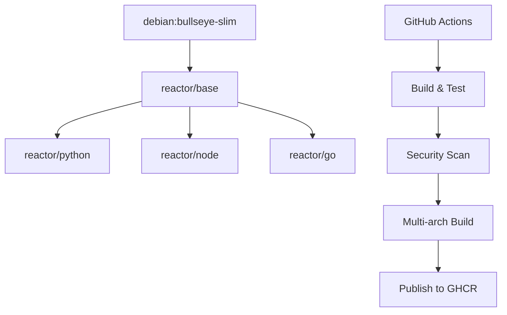

# **Feature Design Document: Phase 5 - Curated Image Publishing**

Version: 1.0  
Status: Draft  
Author(s): Claude, cam  
Date: 2025-08-27

## **1. The 'Why': Rationale & User Focus**

*This section defines the purpose of Phase 5, building upon the successful completion of Phases 1-4 to deliver official, production-ready container images that embody Reactor's core values.*

### **1.1. High-level summary**

Phase 5 transforms Reactor from a tool that works with any Docker image into a platform with official, curated images that provide exceptional out-of-the-box experiences. By creating a layered set of minimal, fast, and secure images (`reactor/base`, `reactor/python`, `reactor/node`, `reactor/go`), we eliminate the current dependency on placeholder images and provide developers with reliable, well-tested environments. These images embody Reactor's design philosophy: they are simple, focused, fast, and always allow users to bring their own custom images when needed.

### **1.2. User personas**

* **Primary Persona: The Quick-Start Developer ("QuickDev")**: A developer who wants to start using Reactor immediately without configuration overhead. They value speed, reliability, and having common tools available by default. They represent 80% of Reactor users who need a "just works" experience.

* **Secondary Persona: The Language Specialist ("LangDev")**: A Python, Node.js, or Go developer who needs a rich development environment with modern tooling. They value having the latest package managers, linters, and debugging tools pre-installed while maintaining container speed.

* **Tertiary Persona: The Security-Conscious Developer ("SecDev")**: A developer working in regulated environments who needs reproducible builds, pinned versions, and vulnerability-free images. They value transparency in what's installed and regular security updates.

### **1.3. Problem statement & user stories**

**Problem Statement:**
Currently, Reactor relies on placeholder images (`ghcr.io/dyluth/claude-reactor-go`) that don't reflect our design principles, lack proper maintenance, and create a poor first impression. Users face uncertainty about image contents, security, and reliability. The absence of official images forces users to either trust third-party images or build their own, creating friction that prevents adoption.

**User Stories:**

* As a **QuickDev**, I want to run `reactor run` and immediately have Claude CLI, essential development tools, and a reliable environment, so that I can start being productive within seconds.
* As a **LangDev**, I want to use `--image python` and get a modern Python environment with uv, type checking, and debugging tools pre-installed, so that I can focus on development instead of environment setup.
* As a **SecDev**, I want to trust that official Reactor images are built reproducibly with pinned versions and regular security scans, so that I can use them in production environments without security concerns.

### **1.4. Success metrics**

**Business Metrics:**

* Achieve 90% of new Reactor users using official images within their first month (measured via image pull statistics)
* Reduce "environment setup" related GitHub issues by 70% within 3 months of release
* Achieve 4.8+ star rating on GitHub with specific mentions of "easy to use" and "works out of the box"

**Technical Metrics:**

* All official images must be under 500MB compressed size (`reactor/base` < 200MB)
* Container startup time from pull to interactive session < 10 seconds for cached images
* Zero high or critical security vulnerabilities in published images (automated scanning)
* 99.9% successful build rate for automated image publishing pipeline

## **2. The 'How': Technical Design & Architecture**

*This section details the proposed technical solution for creating and maintaining official Reactor images.*

### **2.1. System context & constraints**

* **Technology Stack:** Docker, GitHub Actions, GitHub Container Registry (GHCR), Debian Bullseye Slim, multi-architecture builds (amd64/arm64)
* **Current State:** Reactor currently references `ghcr.io/dyluth/claude-reactor-go` in built-in provider mappings and documentation. The TMP-Dockerfile exists but violates our design principles with its monolithic approach.
* **Technical Constraints:** 
  - Must support both amd64 and arm64 architectures
  - Must integrate with existing Reactor configuration system
  - GitHub Container Registry limits and rate limiting considerations

### **2.2. Guiding design principles**

* **Simplicity over Complexity (YAGNI):** Each image contains only what's necessary for its specific use case. No "kitchen sink" approaches.
* **Consistency with Existing Code:** Images must work seamlessly with Reactor's existing container provisioning, mount strategies, and entrypoint logic.
* **Clarity and Readability:** Dockerfiles are self-documenting with clear comments explaining every decision. Build process is transparent and reproducible.
* **Speed and Efficiency:** Optimized layer caching, minimal image sizes, and fast startup times are prioritized over feature completeness.

### **2.3. Alternatives considered**

**Option 1: Monolithic Multi-Stage Approach (Current TMP-Dockerfile)**
* **Description:** Single Dockerfile with multiple stages creating all variants in one build
* **Pros:** Single file to maintain, shared base layers, easier to ensure consistency
* **Cons:** Complex to understand, violates separation of concerns, harder to optimize individual images, creates unnecessary dependencies

**Option 2: Separate Dockerfiles with Manual Maintenance (The Chosen Approach)**
* **Description:** Individual Dockerfiles in organized directory structure with automated GitHub Actions pipeline
* **Pros:** Clear separation of concerns, easier to optimize each image, easier to maintain and debug, follows Docker best practices
* **Cons:** More files to maintain, potential for drift between images

**Option 3: External Image Registry**
* **Description:** Use Docker Hub or other third-party registry for hosting
* **Pros:** Potentially better performance, established ecosystem
* **Cons:** Less control, potential vendor lock-in, doesn't align with GitHub-centric workflow

**Chosen Approach Justification:**
Option 2 was chosen because it directly aligns with our principle of simplicity and clarity. Each image has a single responsibility and can be understood, modified, and optimized independently. The GitHub Actions automation eliminates manual maintenance concerns while providing full transparency and control.

### **2.4. Detailed design**

The architecture consists of four layered images with automated build and publish pipeline:



#### **2.4.1. Data model updates**

**Image Repository Structure:**
```
/images/
├── base/
│   ├── Dockerfile
│   └── test.sh
├── python/
│   ├── Dockerfile
│   └── test.sh
├── node/
│   ├── Dockerfile
│   └── test.sh
├── go/
│   ├── Dockerfile
│   └── test.sh
└── shared/
    └── entrypoint.sh
```

**Built-in Provider Updates:**
```go
// Update pkg/config/providers.go
var BuiltinProviders = map[string]ProviderInfo{
    "claude": {
        DefaultImage: "ghcr.io/dyluth/reactor/base:latest", // Updated from placeholder
        Mounts: []MountPoint{
            {Source: "claude", Target: "/home/claude/.claude"},
        },
    },
    // ... other providers
}

// Update built-in image mappings
var BuiltinImages = map[string]string{
    "base":   "ghcr.io/dyluth/reactor/base:latest",
    "python": "ghcr.io/dyluth/reactor/python:latest",
    "node":   "ghcr.io/dyluth/reactor/node:latest",
    "go":     "ghcr.io/dyluth/reactor/go:latest",
}
```

#### **2.4.2. Data migration plan**

N/A - Clean break from placeholder images. Only action required is updating default image references in Reactor source code.

#### **2.4.3. API & backend changes**

N/A - No API changes required. The existing image resolution logic in `pkg/config/config.go` will automatically use the new images.

#### **2.4.4. Frontend changes**

N/A - This is a CLI tool with no frontend.

### **2.5. Non-functional requirements (NFRs)**

* **Performance:** 
  - `reactor/base` image size < 200MB compressed
  - Language-specific images < 500MB compressed
  - Container startup time < 10 seconds after image is cached locally
  - Multi-architecture build time < 15 minutes per image

* **Reliability:** 
  - Automated builds must have 99.9% success rate
  - All published images must pass security scans with zero high/critical vulnerabilities
  - Build pipeline must handle GitHub Actions resource limits gracefully

* **Security:**
  - All package versions pinned to specific releases
  - Checksum verification for downloaded binaries where possible
  - Regular automated vulnerability scanning with Trivy
  - Non-root `claude` user with minimal required privileges

* **Operations & Developer Experience:**
  - Complete build-to-publish cycle automated via GitHub Actions
  - Clear documentation for adding new tools or updating versions
  - Local development workflow for testing image changes
  - Automated tagging and release management

## **3. The 'What': Implementation & Execution**

*This section breaks the work into manageable phases and defines testing and quality assurance strategies.*

### **3.1. Phased implementation plan**

**Phase 5.1: Infrastructure & Base Image**
* [ ] PR 5.1.1: Create `/images/` directory structure and move `entrypoint.sh` to `/images/shared/`
* [ ] PR 5.1.2: Create `reactor/base` Dockerfile with essential tools and Claude/Gemini CLIs
* [ ] PR 5.1.3: Set up GitHub Actions workflow for building and testing single image
* [ ] PR 5.1.4: Add Trivy security scanning to build pipeline

**Phase 5.2: Language-Specific Images**
* [ ] PR 5.2.1: Create `reactor/python` Dockerfile with Python 3.11 + uv
* [ ] PR 5.2.2: Create `reactor/node` Dockerfile with Node.js 20 + TypeScript/ESLint
* [ ] PR 5.2.3: Create `reactor/go` Dockerfile with Go 1.22 + development tools
* [ ] PR 5.2.4: Extend GitHub Actions to build all images with multi-architecture support

**Phase 5.3: Integration & Publishing**
* [ ] PR 5.3.1: Update Reactor codebase to use new official images as defaults
* [ ] PR 5.3.2: Implement automated publishing to GitHub Container Registry
* [ ] PR 5.3.3: Add automated testing that verifies AI CLI tools work in each image
* [ ] PR 5.3.4: Update all documentation to reference new official images

**Phase 5.4: Quality & Maintenance**
* [ ] PR 5.4.1: Set up automated security scanning and vulnerability reporting
* [ ] PR 5.4.2: Create maintenance documentation and update procedures
* [ ] PR 5.4.3: Implement image size monitoring and optimization alerts

### **3.2. Testing strategy**

* **Unit Tests:** Each Dockerfile includes a `test.sh` script that verifies all installed tools are functional and have correct versions
* **Integration Tests:** Automated tests that run `reactor run` with each official image and verify:
  - Container starts successfully
  - Claude CLI is functional (`claude --version`)
  - Gemini CLI is functional (if available)
  - Essential tools work (git, jq, ripgrep, etc.)
  - Language-specific tools work (python, npm, go)
* **End-to-End User Story Tests:**
  - **QuickDev Story:** Test script runs `reactor config init`, `reactor run`, and verifies immediate Claude CLI access
  - **LangDev Story:** Test script uses `--image python`, creates a Python project, and verifies uv/pip functionality
  - **SecDev Story:** Test script verifies image metadata shows pinned versions and security scan results
* **Performance Tests:** Automated measurement of image sizes and container startup times in CI
* **Security Tests:** Trivy vulnerability scanning integrated into every build with failure on high/critical issues

## **4. The 'What Ifs': Risks & Mitigation**

*This section addresses potential issues for secure, reliable deployment and management.*

### **4.1. Security & privacy considerations**

* **Supply Chain Security:** All downloads are pinned to specific versions with checksum verification where possible. Build process is fully transparent via GitHub Actions.
* **Container Security:** Images run as non-root `claude` user with minimal required privileges. Regular vulnerability scanning prevents known CVE exposure.
* **Registry Security:** GitHub Container Registry provides secure hosting with access controls. Images are signed and verifiable.

### **4.2. Rollout & deployment**

* **Feature Flags:** Not applicable - new images are opt-in by default
* **Monitoring & Observability:** 
  - **Image Pull Metrics:** GitHub Container Registry provides download statistics
  - **Build Success Rates:** GitHub Actions provides build success/failure metrics
  - **Security Scan Results:** Trivy scan results stored as GitHub Action artifacts
  - **Size Monitoring:** Automated alerts if image sizes exceed thresholds
* **Rollback Plan:** If critical issues are discovered:
  1. Disable automatic publishing in GitHub Actions
  2. Revert to previous image tags in Reactor codebase
  3. Publish hotfix images with corrected issues

### **4.3. Dependencies and integrations**

* **Internal Dependencies:** Reactor's existing image resolution logic in `pkg/config/`
* **External Dependencies:** 
  - GitHub Container Registry availability and rate limits
  - Upstream package repositories (Debian, Node.js, Python, Go)
  - GitHub Actions runner availability
  - AI CLI tool availability (Claude, Gemini)

### **4.4. Cost and resource analysis**

* **Infrastructure Costs:** 
  - GitHub Container Registry storage: ~$5-10/month for all images
  - GitHub Actions compute: ~$20-30/month for automated builds
* **Operational Costs:** 
  - Weekly maintenance reviews: ~2 hours
  - Security update responses: ~4 hours/month
  - New version updates: ~8 hours/quarter

### **4.5. Open questions & assumptions**

**Open Questions:**
* Should we provide versioned tags (e.g., `ghcr.io/dyluth/reactor/base:v1.0.0`) in addition to `:latest`?
* How frequently should we rebuild images for security updates (weekly/monthly)?
* Should we provide minimal variants (e.g., `ghcr.io/dyluth/reactor/base-minimal`) for size-sensitive users?

**Assumptions:**
* Users will prefer official images over custom ones for most use cases
* GitHub Container Registry will remain free for public repositories
* AI CLI tools will remain available and installable via their current methods
* Multi-architecture support is critical for Apple Silicon adoption