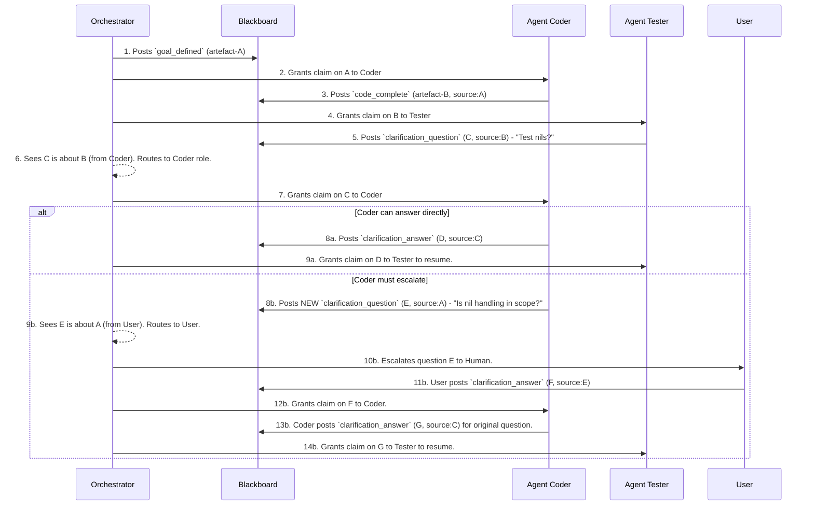

# **Feature Design: `reactor-fabric` - A Container-Native AI Agent Orchestrator**

**Version: 3.0 | Status: Approved | Date: 2025-09-03**

## **1. Vision & Strategy**

### **1.1. High-Level Summary**

`reactor-fabric` is a standalone, **container-native orchestration engine** designed to manage a suite of specialized, tool-equipped AI agents. It is positioned to fill a major gap in the current market, which is dominated by Python-centric, LLM-chaining frameworks.

The core vision is to provide a robust, scalable, and developer-friendly platform for automating complex software engineering tasks by leveraging the power of containerization and the familiar paradigms of DevOps and Platform Engineering.

### **1.2. Core Problem Solved**

Existing multi-agent frameworks are powerful but share a fundamental limitation: they are **LLM-centric**, designed primarily to orchestrate Python functions. This makes them a poor fit for automating the full spectrum of the software development lifecycle, which relies on a diverse ecosystem of compilers, CLIs, and infrastructure tools (`git`, `docker`, `kubectl`, `terraform`).

`reactor-fabric` solves this by shifting the paradigm. It is not an LLM-chaining library; it is a **container-native orchestration engine**. It enables the automation of real-world DevOps and software engineering tasks by orchestrating agents whose tools are not just Python functions, but any command-line tool that can be packaged into a container.

## **2. Architecture**

### **2.1. Key Concepts**

*   **The Agent as a Container:** In `reactor-fabric`, an "agent" is a `reactor` instance. Its environment, capabilities, and tools are explicitly defined by a version-controlled `devcontainer.json` and `Dockerfile`. This provides perfect reproducibility, isolation, and true tooling agnosticism.
*   **Declarative Orchestration:** A `fabric.yml` file defines the composition and workflow of your agent team. You declare which agents are available, what their roles are, and how they are triggered and communicate.
*   **On-Demand, Stateful Spawning:** The fabric dynamically spawns agent containers as needed, managing their lifecycle with strategies like `fresh_per_call` or `reuse_per_session` to balance performance and state persistence.
*   **Client/Server Architecture:** `reactor-fabric` runs as a persistent engine. The `reactor` CLI is the primary client for human interaction, but any application (e.g., a GitHub Action, an IDE extension) can interact with the fabric via its API to trigger complex automated workflows.

### **2.2. Core Architectural Pattern: The Governed Blackboard**

The architecture uses a blackboard pattern with a crucial layer of governance to manage agent activity.

1. **The blackboard:** A centralised, structured, shared memory space representing the 'state of the world'. It holds all data artefacts and their historical lineage.  
2. **Knowledge sources (agents):** Containerised agents that fulfill specific *roles* (e.g., 'tester', 'coder'). They monitor the blackboard for artefacts they can process.  
3. **The control mechanism (orchestrator/governor):** A supervisory component that acts as the single arbiter for all tasks. It manages the lifecycle of artefacts by **granting claims** and routing clarification requests.

### **2.3. System Components**

1. **The Fabric CLI (`reactor-fabric` binary):** A client application and the user's control plane. It is used to send commands to start, stop, and inspect Fabric instances.
2. **The Orchestrator (`governor` container):** The **server** and core of the system. It runs as a long-running process inside a container and holds all the primary orchestration logic. It manages the blackboard and agent lifecycles by communicating with the host's Docker daemon.
3. **The Blackboard (`redis` container):** The single source of truth for a given Fabric instance, managed by the Orchestrator.
4. **Agents (on-demand dev containers):** Ephemeral, tool-equipped containers that are started and stopped by the Orchestrator to perform tasks.

### **2.4. Blackboard Data Structures (Redis)**

* **Artefacts (Redis hashes):** artefact:\<uuid\>  
  * **Fields:** artefact\_type, status, payload, claimed\_by, produced\_by\_agent, produced\_by\_role, source\_artefacts (a JSON array of UUIDs, establishing the historical chain).  
* **Claim/ignore log (Redis lists):** artefact:\<uuid\>:responses.  
* **Global event log (Redis streams):** fabric:events.  
* **Agent heartbeats (Redis hashes):** agent:status.

## **3. Configuration (`fabric.yml`)**

The `fabric.yml` file is the central, declarative configuration for a Fabric instance. It defines the suite of agents available to the orchestrator, their roles, and their operational parameters.

### **3.1. Example Schema**

The schema is designed to be familiar to developers accustomed to `docker-compose.yml`, prioritizing clarity and power.

```yaml
version: '1.0'

# Defines the suite of agents available to the orchestrator.
agents:
  go-coder-agent: # The key is the logical name of the agent
    # Functional grouping for task routing. Multiple agents can share a role.
    role: 'coder' 
    
    # Path to a directory containing a .devcontainer/devcontainer.json file.
    path: './agents/go-coder' 
    
    # Lifecycle strategy. Options: 'reuse' (default) or 'fresh_per_call'.
    strategy: 'reuse' 
    
    # Pass environment variables or secrets to the agent container.
    environment:
      - GITHUB_TOKEN=${GITHUB_TOKEN} # Pass variable from host
      - LOG_LEVEL=debug               # Define variable directly

    # Prompts are required and define the agent's core behavior.
    prompts:
      claim: |
        You are a senior Go developer. Your task is to write application code.
        Only claim tasks that involve writing Go, not testing or deployment.
      execution: |
        You are a senior Go developer. Write Go code to implement the goal.
        Ensure the code is well-formatted and follows standard idioms.

# Optional: Overrides for core infrastructure services.
services:
  orchestrator:
    image: 'reactor/orchestrator:v0.1.0'
  redis:
    image: 'redis:7-alpine'
```

### **3.2. Schema Details**

*   **`version` (required):** The version of the `fabric.yml` schema.
*   **`agents` (required):** A map of agent definitions, where each key is the agent's unique logical name.
    *   `role` (required): A functional name (e.g., `coder`, `tester`) used by the Orchestrator to route tasks. Multiple agents can share the same role.
    *   `path` (required): The file path to the agent's environment definition (a directory containing `devcontainer.json`).
    *   `strategy`: Defines the agent container's lifecycle. Can be `reuse` (long-lived container, default) or `fresh_per_call` (new container for each task).
    *   `environment`: A list of environment variables to be set inside the agent container. Values can be defined directly or passed from the host shell.
    *   `prompts` (required): A block containing the core instructions for the agent.
        *   `claim` (required): The prompt used to decide if the agent should accept a task.
        *   `execution` (required): The prompt used to perform the task after it has been claimed.
*   **`services` (optional):** Allows for overriding the default container images for the core Fabric infrastructure, such as the `orchestrator` itself or `redis`.

## **4. Agent Workflow & Intelligence**

### **4.1. The Agent Intelligence Layer**

An agent's intelligence is not in the container itself, but in the interaction between a stateless LLM and the stateful blackboard, managed by an **Agent Entrypoint Shim**.

The shim's primary role is to create a high-context prompt. It does this by **walking the chain** of source\_artefacts on the blackboard. For any given task, it can trace the full lineage of decisions and data that led to the current state, assembling this history into a rich prompt for the LLM. This makes the agent appear stateful without requiring any memory within the container itself.

### **4.2. The Tiered Clarification Workflow**

The fabric is designed to handle ambiguity gracefully. Instead of failing or hallucinating, agents are encouraged to ask for clarification. The system is explicitly designed to resolve ambiguity between agents before escalating to a human.

**Artefact Chaining** is the core mechanism. Every new artefact's `source_artefacts` field creates an immutable, directed acyclic graph (DAG) of the workflow on the blackboard. This chain provides the full context for any task.

**Recursive Clarification** is the process of resolving questions by walking backwards up this artefact chain.
1. When an agent (e.g., a `tester`) encounters ambiguity, it posts a `clarification_question` artefact to the blackboard, referencing the artefact it was working on.
2. The Orchestrator routes this question to the agent role that produced the source artefact (e.g., a `coder`).
3. This second agent now has a choice:
    - **Answer:** If it can resolve the ambiguity, it posts a `clarification_answer`.
    - **Escalate:** If it cannot, it posts its *own* `clarification_question`, referencing an even earlier artefact in the chain.
4. This process repeats, with the Orchestrator routing questions up the chain of creation. A question is only escalated to a human user if the chain is fully traversed to its root and the responsible agent still cannot provide an answer.

**Workflow Sequence:**



## **5. Command-Line Interface**

### **5.1. Operational Model**

All reactor-fabric instances are namespaced via a mandatory \--name flag. This prefixes all Docker resources (e.g., fabric-webapp-redis) and applies a standard label (com.reactor.fabric.instance=webapp) for atomic management of the entire instance. This follows a client-server model, where the `reactor-fabric` CLI acts as the client and the `orchestrator` container (launched by the CLI) acts as the persistent server.

### **5.2. Commands**

*   `reactor-fabric up --name <instance-name>`: Deploys and starts a new Fabric instance, including the Orchestrator and other core services.
*   `reactor-fabric down --name <instance-name>`: Stops and removes all containers, networks, and resources associated with a Fabric instance.
*   `reactor-fabric list`: Lists all running Fabric instances on the host.
*   `reactor-fabric validate`: Parses a `fabric.yml` file and reports any syntax or configuration errors.

## **6. Phased Implementation Plan**

### **Milestone 1: The namespaced core services (Crawl)**

* **Goal:** Establish the foundational runtime environment, capable of launching multiple, isolated, namespaced instances of the core services.  
* **Key deliverables:** `reactor-fabric up`, `down`, and `list` commands; parsing of `fabric.yml`; running, namespaced Redis and placeholder orchestrator containers on a shared, namespaced Docker network.  
* **Technical design:** The `reactor-fabric` CLI (`up` command) will be responsible for launching the core service containers for a given instance: the **Orchestrator container** and the **Redis container**. It will apply the standard namespacing and labels to these resources. The Orchestrator container will require the host's Docker socket (`/var/run/docker.sock`) to be mounted as a volume, allowing it to manage subsequent agent containers. The `down` command will use the instance label to find and remove all associated resources.

### **Milestone 2: The blackboard client (Crawl)**

* **Goal:** Create a reusable, high-level Go package for all blackboard interactions.  
* **Key deliverables:** A `pkg/blackboard` package with a clean client interface and strongly-typed structs for Artefact, Claim, etc.  
* **Technical design:** The NewClient function will connect to Redis (e.g., via go-redis). The client API will provide high-level methods like PostNewArtefact and SubmitResponse, abstracting away the raw Redis commands.

### **Milestone 3: The governed agent (Crawl)**

* **Goal:** Implement the fundamental lifecycle of a single agent that can operate within a namespaced environment.  
* **Key deliverables:** A base Docker image for agents and a sample coder agent implementation.  
* **Technical design:** The Orchestrator will inject the instance name as an environment variable (FABRIC\_INSTANCE\_NAME) into the agent container. The agent's entrypoint will read this, connect to the correct Redis, and enter its main loop: scan for available artefacts, submit a claim or ignore response, and wait for its claim to be granted.

### **Milestone 4: The synchronous arbiter (Crawl)**

* **Goal:** Implement the initial, simple, single-threaded orchestrator logic that ensures a predictable workflow.  
* **Key deliverables:** A functional orchestrator that grants claims based on a "full consensus" model.  
* **Technical design:** The orchestrator will scan for available artefacts. For each, it will wait until it has received a response (claim or ignore) from **every known agent role** before evaluating the claims and granting one. This deliberately creates a bottleneck for easy initial debugging.

### **Milestone 5: Concurrent operation (Walk)**

* **Goal:** Remove the synchronous bottleneck in the orchestrator to allow for parallel work.  
* **Key deliverables:** An updated orchestrator that grants claims as soon as they are made.  
* **Technical design:** Modify the orchestrator logic to remove the "wait for all roles" gate. It will process claim requests on a first-come, first-served basis, likely using goroutines to handle multiple artefacts concurrently.

### **Milestone 6: Dynamic agent scaling (Run)**

* **Goal:** Evolve the fabric server to an active manager that can scale agent pools based on workload.  
* **Key deliverables:** Logic within the Orchestrator container to monitor the blackboard and start/stop agent containers on the fly.  
* **Technical design:** The **Orchestrator container** will monitor its instance's blackboard. If it sees an available artefact for a role with no idle agents, it will use its access to the host's Docker daemon (via the mounted socket) to launch a new agent container, ensuring it is correctly named, labelled, and networked for that instance.
