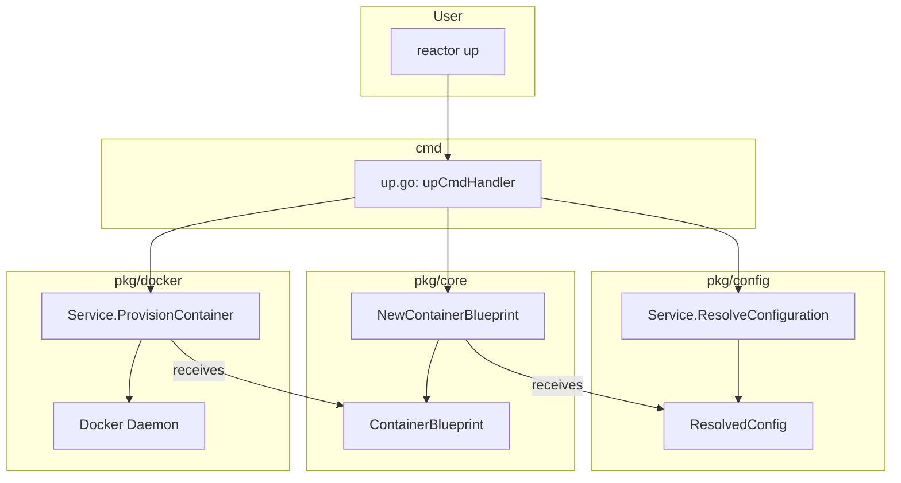

# **Feature Design Document: M1.2 - Core Logic & CLI Refactoring**

Version: 1.0
Status: Approved
Author(s): Gemini, cam
Date: 2025-09-02

## **1. The 'Why': Rationale & User Focus**

### **1.1. High-level summary**

This feature connects the new `devcontainer.json` configuration layer to the application's core logic. It refactors the `pkg/core` and `pkg/docker` packages to consume the new configuration model and implements the new, standards-aligned CLI command structure (`up`, `down`, `exec`, `build`). This work makes `reactor` a functional, entry-level Dev Container tool, allowing users to start, stop, and execute commands in their environments using the `devcontainer.json` file as the single source of truth.

### **1.2. User personas**

*   **Primary Persona: The Modern Developer ("Dev")**: A software engineer who already uses Dev Containers. They want to use `reactor` to seamlessly run the *exact* same environment defined in their project's `devcontainer.json` from the command line.
*   **Secondary Persona: The Platform Engineer ("Ops")**: A DevOps engineer who authors `devcontainer.json` files. They need to validate that `reactor` correctly interprets and provisions environments based on these files, ensuring consistency between IDE and CI/CD workflows.

### **1.3. Problem statement & user stories**

**Problem Statement:**
The application has been refactored to *parse* `devcontainer.json`, but this new configuration is not yet used by the container provisioning logic. The CLI commands are also outdated and do not align with the `devcontainer-cli` standard, creating a confusing user experience.

**User Stories:**

*   As a **Dev**, I want to run `reactor up` in my project directory and have it start a container using the `image` specified in my `devcontainer.json`.
*   As a **Dev**, I want `reactor` to automatically forward the ports defined in `forwardPorts`, so I can access my web application running inside the container.
*   As a **Dev**, I want `reactor` to respect the `remoteUser` property, so I am logged into the container as the correct user.
*   As an **Ops**, I want to use the standard `reactor exec -- <command>` to run tests inside the container, just like I would with other container tools.

### **1.4. Success metrics**

**Technical Metrics:**

*   `reactor up` successfully starts a container using the `image`, `forwardPorts`, and `remoteUser` properties from a `devcontainer.json` file.
*   The `up`, `down`, `exec`, and `build` commands are present in the CLI and functional. The old `run` command is removed.
*   All refactored integration tests pass, verifying the new command structure and core logic.

## **2. The 'How': Technical Design & Architecture**

### **2.1. System context & constraints**

*   **Technology Stack:** Go, Cobra, Docker Go SDK.
*   **Current State:** `pkg/config` has been fully refactored. It now finds and parses `devcontainer.json` into a `ResolvedConfig` struct. The `pkg/core` and `cmd/reactor` packages, however, are not yet using this new configuration flow.
*   **Technical Constraints:** The implementation must not change the `ResolvedConfig` struct. It is the canonical, internal data model that must be consumed by the core logic.

### **2.2. Guiding design principles**

*   **Simplicity over Complexity (YAGNI):** The refactoring should simplify the data flow, not add unnecessary layers. The mapping from `ResolvedConfig` to the container blueprint should be direct and clear.
*   **Consistency with Existing Code:** The new CLI structure must follow the patterns established by the Cobra framework in the rest of the project.
*   **Clarity and Readability:** The purpose of the new `up`, `down`, and `exec` commands should be immediately obvious to anyone familiar with tools like Docker Compose or the official `devcontainer-cli`.

### **2.3. Alternatives considered**

**Option 1: Refactor In-Place (Chosen Approach)**
*   **Description:** Refactor the existing `pkg/core` and `cmd/reactor` packages to align with the new data flow and CLI structure.
*   **Pros:** This is a clean, direct approach that removes dead code and aligns the entire application with the new strategy.
*   **Cons:** Requires careful, coordinated changes across two packages.

**Option 2: Create a Compatibility Layer**
*   **Description:** Create a new layer that translates the old command structure and data flow into the new one, allowing `pkg/core` to remain untouched for now.
*   **Pros:** Might seem less risky by isolating changes.
*   **Cons:** Violates YAGNI by creating a complex, unnecessary abstraction that would need to be removed later. It goes against the "clean break" principle. **Rejected.**

**Chosen Approach Justification:**
The in-place refactoring is the only option that aligns with our project principles. It is the simplest and most direct path to achieving our strategic goals.

### **2.4. Detailed design**

This feature will be implemented by refactoring the `pkg/core` and `cmd/reactor` packages.

#### **2.4.1. Configuration Layer Updates (`pkg/config`)**

The `ResolvedConfig` struct and mapping logic must be updated to include the new devcontainer.json properties.

*   **Files to Modify:** `pkg/config/models.go`, `pkg/config/service.go`
*   **Changes:**
    1.  **Add fields to ResolvedConfig:** Add `ForwardPorts []PortMapping` and `RemoteUser string` fields to the `ResolvedConfig` struct.
    2.  **Define PortMapping type:** Add a `PortMapping` struct with `HostPort int` and `ContainerPort int` fields in the config package.
    3.  **Update mapToResolvedConfig():** Parse and validate `devConfig.ForwardPorts []interface{}` with fail-fast error handling:
        *   `int` values (e.g., `8080`) map to same port on both host and container (8080:8080)
        *   `string` values (e.g., `"8080:3000"`) parse as host:container mappings
        *   Invalid formats cause immediate failure with clear error messages
    4.  **Copy RemoteUser:** Map `devConfig.RemoteUser` to `resolved.RemoteUser`

#### **2.4.2. CLI Layer Updates (`cmd/reactor`)**

The `upCmdHandler` will implement the port merge-and-override logic combining devcontainer.json ports with CLI flags.

*   **File to Modify:** `cmd/reactor/main.go`
*   **Port Merge Logic:**
    1.  **Base:** Use ports from `resolved.ForwardPorts` (parsed from devcontainer.json)
    2.  **Override:** CLI `--port` flags take precedence on host port conflicts
    3.  **Addition:** CLI ports with no conflicts are added to the list
    4.  **Example:** devcontainer.json has `"8080:8000"`, CLI has `-p 8080:3000` → final result is `8080:3000`
    5.  **Conflict Detection:** Run `checkPortConflicts()` only on the final merged list
*   **Implementation Flow:**
    1.  Extract `resolved.ForwardPorts` from config resolution
    2.  Parse CLI `--port` flags as before
    3.  Apply merge-and-override logic
    4.  Convert final list to `[]core.PortMapping` for `NewContainerBlueprint`

#### **2.4.3. Core Logic Updates (`pkg/core`)**

The `core.NewContainerBlueprint` function will consume the new properties from `ResolvedConfig`.

*   **File to Modify:** `pkg/core/blueprint.go`
*   **Function to Modify:** `NewContainerBlueprint`
*   **Logic:**
    1.  **No signature changes:** Function continues to accept final `portMappings []PortMapping` parameter
    2.  **RemoteUser handling:** Use `resolved.RemoteUser` as primary source, default to `"claude"` if empty
    3.  **Port mapping:** Continue using the passed `portMappings` parameter (now merged from devcontainer.json + CLI)
    4.  **Image mapping:** Already correctly uses `resolved.Image`

#### **2.4.4. Data Flow Diagram**

### **2.5. Non-functional requirements (NFRs)**

*   **Performance:** The new logic should not introduce any noticeable latency. Container startup time remains the primary metric.
*   **Reliability:** The mapping from `ResolvedConfig` to `ContainerBlueprint` must be robust, with clear error handling for invalid `forwardPorts` values.

## **3. The 'What': Implementation & Execution**

### **3.1. Phased implementation plan**

This work can be done in a single, focused Pull Request.

*   **PR 1: Configuration Layer Updates**
    *   [ ] Add `PortMapping` struct and `ForwardPorts []PortMapping`, `RemoteUser string` fields to `ResolvedConfig` in `pkg/config/models.go`
    *   [ ] Update `mapToResolvedConfig()` in `pkg/config/service.go` to parse and validate `forwardPorts` from devcontainer.json
    *   [ ] Add comprehensive unit tests for port parsing logic (int/string formats, validation failures)
    
*   **PR 2: CLI Layer Updates**  
    *   [ ] Implement port merge-and-override logic in `upCmdHandler` in `cmd/reactor/main.go`
    *   [ ] Add integration between devcontainer.json ports and CLI `--port` flags
    *   [ ] Update port conflict detection to work on final merged list
    
*   **PR 3: Core Layer Updates**
    *   [ ] Update `NewContainerBlueprint` in `pkg/core/blueprint.go` to use `resolved.RemoteUser` with fallback
    *   [ ] Add unit tests for RemoteUser handling
    *   [ ] Update integration tests to verify complete devcontainer.json property support

### **3.2. Testing strategy**

*   **Unit Tests:**
    *   Create `pkg/core/blueprint_test.go`.
    *   Add tests for `NewContainerBlueprint` to verify that `Image`, `RemoteUser`, and `ForwardPorts` (in both integer and string format) are correctly mapped from `ResolvedConfig`.
*   **Integration Tests:**
    *   Refactor the existing integration tests in `pkg/integration` to use the new `reactor up` command instead of `reactor run`.
    *   Add a new integration test case that uses a `devcontainer.json` fixture with `forwardPorts` and `remoteUser` defined, and verifies that the resulting container has the correct ports mapped and is running as the correct user.

## **4. The 'What Ifs': Risks & Mitigation**

*   **Risk:** The `forwardPorts` property in `devcontainer.json` has a flexible schema (string or int). This could lead to parsing errors.
*   **Mitigation:** The parsing logic in `NewContainerBlueprint` must be robust. It should use type assertions to check the type of each item in the `ForwardPorts` slice and handle both `string` and `float64` (as JSON numbers are unmarshalled into floats in Go) gracefully. Any invalid format should result in a clear, user-friendly error message.
*   **Risk:** The CLI refactoring could be confusing if not done cleanly.
*   **Mitigation:** The changes should be done atomically in a single PR. Renaming `run.go` to `up.go` is preferable to creating a new file to preserve git history.
