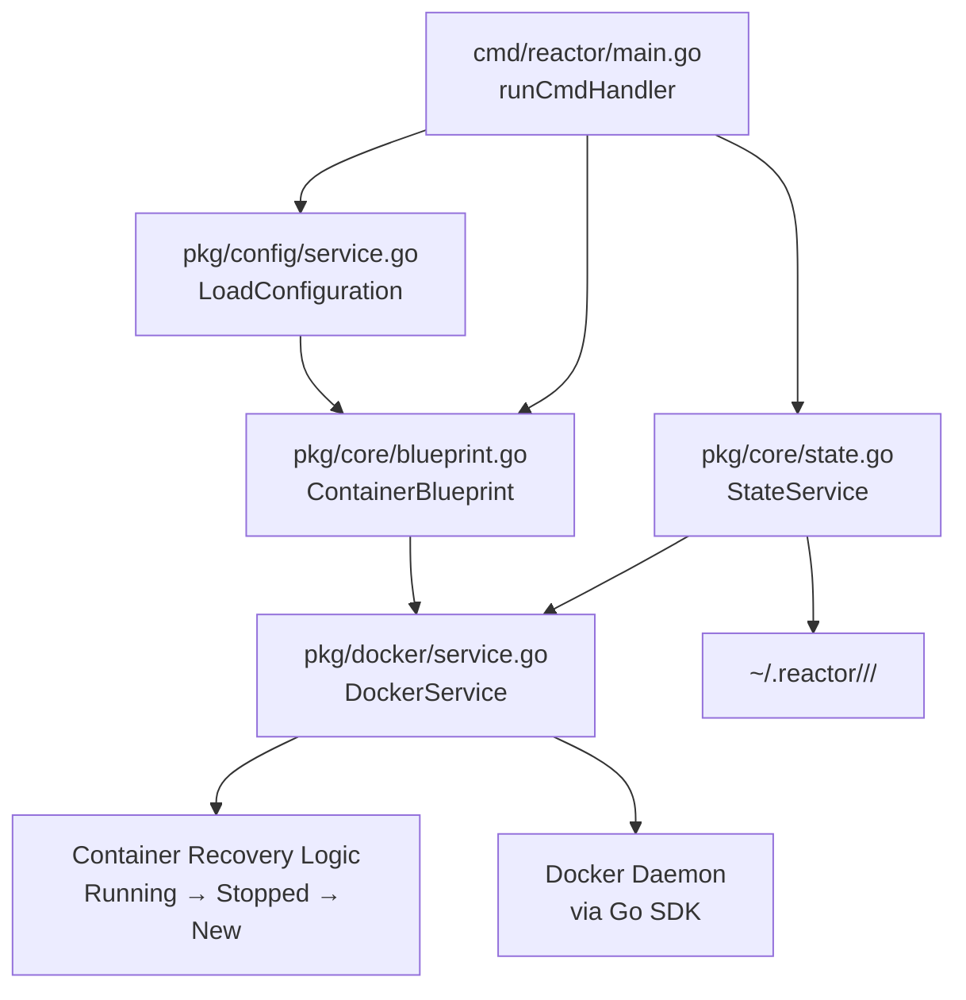

# **Feature Design Document: Phase 2 - Container Provisioning**

Version: 1.0  
Status: Draft  
Author(s): Claude, cam  
Date: 2025-08-25

## **1. The 'Why': Rationale & User Focus**

*This section defines the purpose of Phase 2, building on the configuration foundation from Phase 1 to deliver actual container provisioning functionality.*

### **1.1. High-level summary**

Phase 2 implements the core container provisioning functionality that transforms Reactor from a configuration management tool into a fully working containerized development environment system. It enables developers to launch AI agents in isolated Docker containers with persistent, account-based configuration management through a single `reactor run` command, complete with intelligent container recovery and state management.

### **1.2. User personas**

* **Primary Persona: The AI-Powered Developer ("Dev")**: A software engineer who configured their project in Phase 1 and now wants to actually run their AI agents in clean, isolated containers. They need fast container startup, automatic session recovery, and seamless switching between projects without manual Docker commands.

* **Secondary Persona: The Tool Onboarder ("Ops")**: A developer who needs to understand how containers are provisioned and managed, including the discovery mode functionality to see what files AI agents create and where they store configuration data.

### **1.3. Problem statement & user stories**

**Problem Statement:**
Phase 1 provided comprehensive configuration management, but `reactor run` currently returns "Container provisioning not implemented yet." Developers have configured their projects but cannot use them. They need the actual Docker container lifecycle management, state directory mounting, and session recovery that makes Reactor useful for daily development work.

**User Stories:**

* As a **Dev**, I want `reactor run` to launch my configured AI agent in a containerized environment (after running `reactor config init`), so that I can start working immediately without manual Docker commands.
* As a **Dev**, I want my container to automatically recover from previous sessions, so that I can resume work quickly without losing my environment setup.
* As a **Dev**, I want my AI agent configurations to persist across container restarts, so that I don't have to reconfigure authentication tokens and preferences repeatedly.
* As a **Dev**, I want clear feedback when container operations fail or when setup is incomplete, so that I can troubleshoot issues and understand required setup steps quickly.
* As an **Ops**, I want to run agents in discovery mode to see what files they create, so that I can understand their configuration footprint for team standardization.

### **1.4. Success metrics**

**Business Metrics:**
* **Developer Productivity**: Reduce time from project setup to working AI session from 15+ minutes (manual Docker setup) to under 90 seconds for new containers, 3 seconds for recovered containers.
* **Configuration Consistency**: Achieve 100% isolation between different accounts and projects, with zero configuration conflicts reported.

**Technical Metrics:**
* **Performance**: P99 latency for `reactor run` must be under 90 seconds for new containers and under 3 seconds for recovered containers.
* **Reliability**: Achieve 99.9% success rate for container creation and recovery operations.
* **Error Handling**: All Docker daemon connection failures must result in clear, actionable error messages within 10 seconds.

## **2. The 'How': Technical Design & Architecture**

*This section details the container provisioning architecture, building on Phase 1's configuration system.*

### **2.1. System context & constraints**

* **Technology Stack**: Go 1.21+, Docker Go SDK, existing Cobra CLI framework from Phase 1, YAML configuration system from Phase 1.
* **Current State**: Phase 1 implemented complete CLI structure and configuration management. The `runCmdHandler` currently loads and validates configuration but returns "Container provisioning not implemented yet." All configuration, validation, and account isolation logic is working.
* **Technical Constraints**: 
  * Must integrate seamlessly with existing Phase 1 configuration system
  * Depends on Docker daemon running on host machine
  * Must support container recovery logic (running → stopped → create new)
  * Must handle Docker daemon connection failures gracefully
  * Must work on macOS and Linux (amd64/arm64)

### **2.2. Guiding design principles**

* **Simplicity over Complexity (YAGNI)**: Implement straightforward Docker operations without unnecessary abstraction layers. Use deterministic container naming for recovery rather than complex state databases.
* **Consistency with Phase 1**: Follow the established modular architecture patterns. Reuse existing configuration structures (`ResolvedConfig`, `ProviderInfo`) without modification.
* **Clarity and Readability**: Separate Docker operations, state management, and orchestration into distinct layers that can be understood and tested independently.

### **2.3. Alternatives considered**

**Option 1: Docker SDK with Smart Recovery Logic (Chosen Approach)**
* **Description**: Use the official Docker Go SDK with a three-phase container recovery strategy: 1) Check for running container with deterministic name, 2) Check for stopped container and restart it, 3) Create new container only if needed. State directories are managed separately and mounted into containers.
* **Pros**: Robust error handling, efficient container reuse, integrates well with existing Go codebase, provides fine-grained control over container lifecycle.
* **Cons**: More complex than simple creation/deletion, requires careful container naming strategy.

**Option 2: Docker CLI Wrapper (Simple Approach)**  
* **Description**: Shell out to docker CLI commands for all operations. Use simple bash scripts for container management.
* **Pros**: Extremely simple to implement, leverages existing docker CLI knowledge.
* **Cons**: Poor error handling, difficult to implement complex recovery logic, harder to test, less portable across platforms.

**Option 3: Docker Compose Integration**
* **Description**: Generate docker-compose.yml files for each project and use Docker Compose for container management.
* **Pros**: Familiar tooling for some users, handles complex multi-container scenarios.
* **Cons**: Overkill for single-container use cases, adds dependency complexity, doesn't align with simple CLI tool goals.

**Chosen Approach Justification:**
Option 1 was chosen because it directly solves the user stories around fast container recovery and robust error handling while maintaining consistency with Phase 1's Go-based architecture. The Docker SDK provides the control needed for intelligent recovery logic and graceful error handling that's essential for a good developer experience.

### **2.4. Detailed design**

The Phase 2 architecture adds three new components to the existing Phase 1 foundation:

**New Components:**
1. **`pkg/docker/`** (Container Provisioning Layer): Manages Docker daemon interactions
2. **`pkg/core/state.go`** (State Validation Service): Validates existence of ~/.reactor/ directories and provides mount specifications  
3. **`pkg/core/blueprint.go`** (Container Blueprint): Defines complete container specification

**Integration Points:**
- `cmd/reactor/main.go`: Replace "not implemented yet" with real provisioning logic
- `pkg/config/service.go`: No changes needed - Phase 1 configuration system is used as-is



#### **2.4.1. Data model updates**

**New structs (no changes to existing Phase 1 models):**

```go
// pkg/core/blueprint.go
type ContainerBlueprint struct {
    Name        string            // Deterministic container name: "reactor-{account}-{project-hash}"
                                  // Example: "reactor-work-account-92b55e12"
                                  // Will be prefixed with the value of $REACTOR_TEST_ENV if set 
                                  // (e.g., "e2e-test-reactor-...") for test isolation.
    Image       string            // Resolved container image  
    Mounts      []MountSpec       // Volume mounts for state directories
    Environment []EnvVar          // Environment variables
    WorkDir     string            // Working directory in container
    Command     []string          // Command to run in container
    User        string            // Container user (e.g., "claude")
    NetworkMode string            // Network configuration
    ProjectRoot string            // Host project directory to mount
}

type MountSpec struct {
    Source string // Host path (e.g., ~/.reactor/cam/abc12345/claude)
    Target string // Container path (e.g., /home/claude/.claude) 
    Type   string // "bind" for bind mounts
}

type EnvVar struct {
    Key   string
    Value string
}

// pkg/docker/container.go  
type ContainerStatus string
const (
    StatusRunning ContainerStatus = "running"
    StatusStopped ContainerStatus = "stopped" 
    StatusNotFound ContainerStatus = "not_found"
)

type ContainerInfo struct {
    ID     string
    Name   string 
    Status ContainerStatus
    Image  string
}
```

#### **2.4.2. Data migration plan**

N/A. This extends the existing system without changing data formats.

#### **2.4.3. API & backend changes**

N/A. This is a CLI tool.

#### **2.4.4. Frontend changes**

N/A. This is a CLI tool.

**CLI Integration Points:**

```go
// cmd/reactor/main.go - Updated runCmdHandler
func runCmdHandler(cmd *cobra.Command, args []string) error {
    // Phase 1 code (unchanged)
    resolved, err := configService.LoadConfiguration(provider, account, image, danger)
    if err != nil {
        return err
    }
    
    // Phase 2 additions
    stateService := core.NewStateService(resolved)
    if err := stateService.ValidateDirectories(); err != nil {
        return fmt.Errorf("required directories not found: %w\n\nRun 'reactor config init' to set up this project", err) 
    }
    
    blueprint := core.NewContainerBlueprint(resolved, stateService.GetMounts())
    dockerService := docker.NewService()
    
    container, err := dockerService.ProvisionContainer(cmd.Context(), blueprint)
    if err != nil {
        return fmt.Errorf("failed to provision container: %w", err)
    }
    
    fmt.Printf("Container %s is ready. Connecting...\n", container.Name)
    err = dockerService.AttachInteractiveSession(cmd.Context(), container.ID)
    
    // Display cleanup message when session ends
    fmt.Printf("\nSession ended. Container '%s' is still running.\n", container.Name)
    fmt.Printf("Use 'docker stop %s' to stop it, or 'docker rm -f %s' to remove it.\n", container.Name, container.Name)
    
    return err
}
```

### **2.5. Non-functional requirements (NFRs)**

* **Performance**: 
  * P99 container provisioning latency < 90 seconds for new containers
  * P99 container recovery latency < 3 seconds for existing containers  
  * State directory preparation < 1 second
* **Scalability**: Support up to 50 concurrent projects per account without performance degradation
* **Reliability**: 
  * 99.9% success rate for container operations when Docker daemon is healthy
  * All Docker SDK calls wrapped with 60-second timeouts to prevent hanging
  * Graceful degradation when Docker daemon is unreachable
* **Operations & Developer Experience**:
  * Clear error messages for common failure scenarios (Docker not running, image pull failures, permission issues)
  * Structured logging with correlation IDs for debugging
  * All operations testable without requiring Docker daemon (via interfaces/mocks)

## **3. The 'What': Implementation & Execution**

*This section breaks Phase 2 work into manageable pieces with clear deliverables.*

### **3.1. Phased implementation plan**

**Phase 2.1: Docker Layer Foundation**
* [ ] PR 2.1.1: Create `pkg/docker/` package structure with service interface and basic container operations (create, start, stop, remove)
* [ ] PR 2.1.2: Implement container recovery logic with deterministic naming strategy
* [ ] PR 2.1.3: Add Docker daemon health checking and error handling with clear user messages

**Phase 2.2: State Validation Service**  
* [ ] PR 2.2.1: Create `pkg/core/state.go` with StateService for validating ~/.reactor/ directory existence
* [ ] PR 2.2.2: Implement mount point specification generation from existing directories
* [ ] PR 2.2.3: Add clear error messaging when required directories are missing

**Phase 2.3: Container Blueprint & Integration**
* [ ] PR 2.3.1: Create `pkg/core/blueprint.go` with ContainerBlueprint data structure and builder
* [ ] PR 2.3.2: Integrate StateService and Blueprint with existing Phase 1 configuration system
* [ ] PR 2.3.3: Replace "not implemented yet" in `runCmdHandler` with full provisioning logic

**Phase 2.4: Interactive Session Management**
* [ ] PR 2.4.1: Implement TTY attachment and interactive session handling
* [ ] PR 2.4.2: Add graceful session cleanup with specific exit messages
* [ ] PR 2.4.3: Add container lifecycle management (leave running with cleanup guidance)

### **3.2. Testing strategy**

All integration and end-to-end tests **must** be executed with the `REACTOR_ISOLATION_PREFIX` environment variable set to a unique value. This ensures that each test run is fully isolated and does not interfere with the user's default `~/.reactor` directory or other concurrent tests.

* **Unit Tests**: 
  * **StateService**: Test directory validation, mount point specification generation, error messaging for missing directories
  * **DockerService**: Test container operations using Docker SDK mocks, verify recovery logic with different container states
  * **ContainerBlueprint**: Test blueprint generation with various configuration inputs
* **Integration Tests**: 
  * **Full Container Lifecycle**: Test complete flow from configuration to running container using test Docker daemon
  * **Container Recovery**: Create containers, stop them, verify recovery logic works correctly
  * **State Persistence**: Verify files created in containers persist across container restarts
* **End-to-End User Story Tests**:
  * **Dev Story 1**: Script that runs `reactor run`, verifies container starts, creates a file, exits session, runs `reactor run` again, verifies file persists and session recovers quickly
  * **Dev Story 2**: Script that runs `reactor run` with different accounts, verifies complete isolation between account configurations
  * **Container Recovery Story**: Script that manually deletes a Reactor container, runs `reactor run`, verifies automatic detection and recreation
  * **Directory Validation Story**: Script that runs `reactor run` in fresh project without `reactor config init`, verifies clear error message directing user to run init

## **4. The 'What Ifs': Risks & Mitigation**

*This section addresses potential issues and mitigation strategies for container provisioning.*

### **4.1. Security & privacy considerations**

* **Container Isolation**: Containers run with non-root user (`claude`) to limit potential security impact. No privileged mode unless explicitly requested via `--danger` flag.
* **Host Directory Access**: State directories under `~/.reactor/` are mounted with specific permissions (read/write for owner only). Project directories are mounted read-only by default.
* **Docker Socket Access**: The `--danger` flag (future Phase 4) will mount Docker socket into container, which grants host-level Docker access. This will be clearly documented as a security risk.
* **Data Privacy**: AI agent configuration files may contain API tokens. These are isolated per account and never shared between projects or accounts.

### **4.2. Rollout & deployment**

* **Feature Flags**: N/A - Phase 2 replaces existing "not implemented yet" behavior
* **Monitoring & Observability**: 
  * **Key Metrics**: container.create.duration, container.recovery.duration, container.failure.rate, state.directory.creation.duration
  * **Logging**: Structured JSON logging with correlation IDs. INFO level for operations, ERROR level for failures with full context
  * **Error Tracking**: All Docker SDK errors categorized (daemon unreachable, image pull failures, permission issues) for better user messaging
* **Rollback Plan**: Phase 1 configuration system remains unchanged. In emergency, can revert to "not implemented yet" behavior by reverting container provisioning PRs.

### **4.3. Dependencies and integrations**

* **External Dependencies**: 
  * Docker daemon must be running and accessible to user
  * Container images must be pullable from configured registries
  * Docker Go SDK version compatibility with user's Docker daemon version
* **Internal Dependencies**: 
  * Builds on Phase 1 configuration system without modifications
  * Requires filesystem permissions to create directories under ~/.reactor/
* **Failure Scenarios**: 
  * Docker daemon not running → Clear error message with installation/startup instructions
  * Image pull failures → Retry logic with fallback to cached images
  * Insufficient disk space → Clear error message with cleanup suggestions

### **4.4. Cost and resource analysis**

* **Infrastructure Costs**: N/A - runs entirely on user's local machine
* **Resource Usage**:
  * Disk space: Container images (~500MB-2GB per image), state directories (~10-100MB per project)
  * Memory: Container overhead (~50-200MB per running container)
  * CPU: Minimal overhead for container management operations

### **4.5. Design decisions & assumptions**

**Design Decisions (based on project principles):**
* **Container Lifecycle**: Containers remain running after sessions end to give users full control. Specific exit message: `"Session ended. Container 'reactor-account-hash' is still running. Use 'docker stop ...' to stop it, or 'docker rm -f ...' to remove it."`
* **Manual Container Deletion**: Handled gracefully by recovery logic - next `reactor run` will detect missing container and create a new one.
* **Resource Limits**: No CPU/memory limits imposed by default, following YAGNI principle.
* **Directory Creation**: `reactor run` will NOT create directories - it validates existence and fails with clear error if missing, directing users to run `reactor config init`.
* **Image Compatibility**: During container recovery, assume existing container image is compatible and connect directly without version checking.

**Assumptions:**
* Users have Docker installed with proper permissions (not requiring sudo for docker commands)
* Required state directories exist (created by `reactor config init`) before running containers
* Container image changes will be handled in future phases - Phase 2 assumes stable image configuration
* AI agents will properly utilize mounted configuration directories when they exist
* Container images contain a compatible user setup (claude user or similar)
* Users have sufficient disk space for container images and state directories (~2-5GB per project)