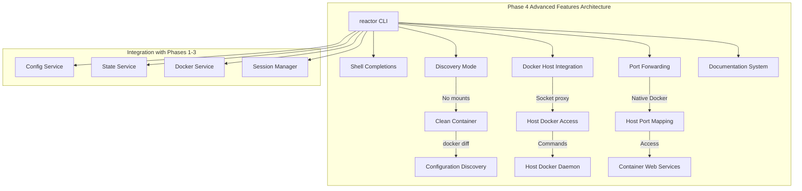

# **Feature Design Document: Phase 4 - Advanced Features & Developer Experience**

Version: 1.0  
Status: Draft  
Author(s): Claude, cam  
Date: 2025-08-27

## **1. The 'Why': Rationale & User Focus**

*This section defines the purpose of Phase 4, building upon the successful completion of Phases 1-3 to deliver the final features that make Reactor a complete, professional-grade CLI tool.*

### **1.1. High-level summary**

Phase 4 completes Reactor's evolution into a production-ready CLI tool by implementing essential developer experience features and advanced capabilities. Building on the solid foundation of Phases 1-3 (CLI/config, container provisioning, and interactive session management), Phase 4 adds shell completions for professional polish, discovery mode for AI tool evaluation, Docker host integration for advanced workflows, port forwarding for web development, and comprehensive documentation. These features transform Reactor from a functional tool into a complete, trustworthy platform that developers actively choose to use.

### **1.2. User personas**

* **Primary Persona: The AI-Powered Developer ("Dev")**: A software engineer who has adopted Reactor for daily AI CLI work and now needs advanced features like port forwarding for web development, shell completions to reduce typing errors, and comprehensive documentation to unlock Reactor's full potential.

* **Secondary Persona: The Tool Onboarder ("Ops")**: A developer or DevOps engineer responsible for evaluating and integrating new AI tools into their team's workflow. They need discovery mode to understand an AI agent's configuration footprint and create standardized environments.

* **Tertiary Persona: The Docker Expert ("Docker-Dev")**: An advanced developer with complex Docker-in-Docker workflows who needs Docker host integration to run container orchestration tools from within Reactor containers.

### **1.3. Problem statement & user stories**

**Problem Statement:**
While Phases 1-3 delivered functional container provisioning and session management, developers face friction in advanced workflows and lack professional CLI features they expect from production tools. Tool onboarders cannot easily evaluate new AI agents' configuration requirements, and the absence of shell completions and comprehensive documentation creates barriers to adoption and effective usage.

**User Stories:**

* As a **Dev**, I want tab completion for all reactor commands and flags, so that I can work efficiently without memorizing syntax and avoid typing errors.
* As an **Ops**, I want to run a new AI agent in discovery mode with no file mounts, so that I can see exactly what configuration files it creates and where, enabling proper mounting strategy design.
* As a **Docker-Dev**, I want to access the host Docker daemon from within my Reactor container, so that I can run Docker commands and orchestration tools as part of my development workflow.
* As a **Dev**, I want to forward ports from my container to my host machine, so that I can access web servers and development tools running inside the container.
* As a **Dev**, I want comprehensive documentation with practical examples, so that I can quickly learn advanced features and troubleshoot issues without reading source code.

### **1.4. Success metrics**

**Business Metrics:**

* **Professional Tool Adoption**: Achieve feedback that Reactor "feels like a professional CLI tool" from 90% of users within 3 months of Phase 4 release
* **Tool Evaluation Usage**: 80% of teams evaluating new AI tools report using Reactor's discovery mode as part of their assessment process
* **Reduced Support Burden**: Decrease documentation-related questions by 70% through comprehensive guides and troubleshooting resources

**Technical Metrics:**

* **Shell Completion Success**: A user can successfully tab-complete all `reactor` subcommands and their associated flags in their chosen shell (Bash, Zsh, or Fish)
* **Discovery Mode Efficiency**: A user can successfully determine configuration path for a new AI tool using discovery mode in under 5 minutes (from `reactor run --discovery-mode` through `reactor diff`)
* **Port Forwarding Reliability**: Web servers running in containers are accessible on host machines with 99.5% success rate
* **Docker Integration Success**: Docker commands executed within containers using `--docker-host-integration` succeed at the same rate as host execution

## **2. The 'How': Technical Design & Architecture**

*This section details the advanced features architecture building upon Phase 3's interactive session management foundation.*

### **2.1. System context & constraints**

* **Technology Stack**: Go 1.23+, Cobra CLI Framework with built-in completions, Docker Go SDK v25.0.0+, socat for socket proxying
* **Current State**: Phase 3 delivered complete interactive session management with enhanced terminal handling and container discovery. Phase 4 builds on this stable foundation without architectural changes
* **Technical Constraints**: 
  * Must maintain compatibility with all Phase 1-3 functionality
  * Shell completions limited to static completions (no dynamic Docker queries)
  * Docker host integration is Unix-only (macOS/Linux)
  * Port forwarding uses Docker's native capabilities only

### **2.2. Guiding design principles**

* **Professional Polish**: Every feature must meet the quality standards developers expect from production CLI tools
* **YAGNI Implementation**: Use existing Cobra completion capabilities rather than custom logic; implement simplest effective solutions
* **User Control**: All features are explicit and opt-in; no automatic behaviors that surprise users
* **Clear Error Reporting**: Every failure mode has actionable error messages with specific next steps

### **2.3. Alternatives considered**

**Option 1: Cobra Built-in Completions (Chosen Approach)**
* **Description**: Use Cobra's native completion generation with static command/flag completions
* **Pros**: Standard, robust, zero maintenance overhead, follows CLI best practices
* **Cons**: No dynamic completions (e.g., container names), but this is acceptable for initial implementation

**Option 2: Custom Completion Logic**  
* **Description**: Implement custom completion scripts with Docker API integration
* **Pros**: Could provide dynamic container name completion
* **Cons**: Complex, maintenance overhead, slower completion response, over-engineering

**Chosen Approach Justification:**
Option 1 was chosen because it delivers immediate professional polish with zero complexity overhead. Dynamic completions can be added later if user demand justifies the complexity, but static completions solve 95% of the usability problem.

### **2.4. Detailed design**

Phase 4 implements five focused features that complete Reactor's functionality:



#### **2.4.1. Data model updates**

**Enhanced Container Blueprint for Discovery Mode:**
```go
// Updated ContainerBlueprint constructor
func NewContainerBlueprint(resolved *config.ResolvedConfig, mounts []MountSpec, isDiscovery bool) *ContainerBlueprint {
    var containerName string
    if isDiscovery {
        containerName = GenerateDiscoveryContainerName(resolved.Account, resolved.ProjectRoot, resolved.ProjectHash)
    } else {
        containerName = GenerateContainerName(resolved.Account, resolved.ProjectRoot, resolved.ProjectHash)
    }
    // ... rest of constructor
}

// Discovery container naming
func GenerateDiscoveryContainerName(account, projectPath, projectHash string) string {
    folderName := filepath.Base(projectPath)
    safeFolderName := sanitizeContainerName(folderName)
    
    baseName := fmt.Sprintf("reactor-discovery-%s-%s-%s", account, safeFolderName, projectHash)
    if prefix := os.Getenv("REACTOR_ISOLATION_PREFIX"); prefix != "" {
        return fmt.Sprintf("%s-%s", prefix, baseName)
    }
    return baseName
}
```

**Port Forwarding Configuration:**
```go
// Port forwarding specification
type PortMapping struct {
    HostPort      string // "8080"
    ContainerPort string // "3000"  
    Protocol      string // "tcp" (default)
}

// Enhanced ContainerSpec
type ContainerSpec struct {
    // ... existing fields
    PortMappings []PortMapping // New field for port forwarding
}
```

#### **2.4.2. Data migration plan**

N/A. All Phase 4 features are additive and do not require data migration.

#### **2.4.3. API & backend changes**

**Enhanced CLI Commands:**

```bash
# Shell completion commands
reactor completion bash    # Outputs bash completion script
reactor completion zsh     # Outputs zsh completion script  
reactor completion fish    # Outputs fish completion script

# Discovery mode
reactor run --discovery-mode [--image python] [--account work]
reactor diff [container-name]  # Defaults to current project's discovery container

# Docker host integration
reactor run --docker-host-integration [other-flags]

# Port forwarding
reactor run -p 8080:3000 -p 9000:9000 [other-flags]
```

**New Command Handlers:**
```go
func newCompletionCmd() *cobra.Command {
    cmd := &cobra.Command{
        Use:   "completion [bash|zsh|fish]",
        Short: "Generate shell completion scripts",
        Long: `Generate completion scripts for your shell.
        
To install completions:
  # Bash
  source <(reactor completion bash)
  
  # Zsh  
  source <(reactor completion zsh)
  
  # Fish
  reactor completion fish | source`,
        Args: cobra.ExactArgs(1),
        RunE: completionHandler,
    }
    return cmd
}

func newDiffCmd() *cobra.Command {
    cmd := &cobra.Command{
        Use:   "diff [container-name]",
        Short: "Show container filesystem changes", 
        Long: `Show changes made to container filesystem during AI agent session.
        
Without arguments, diffs the discovery container for the current project.
With container-name, diffs the specified container.`,
        RunE: diffCmdHandler,
    }
    return cmd
}
```

#### **2.4.4. Frontend changes**

**Enhanced runCmdHandler with New Flags:**
```go
func newRunCmd() *cobra.Command {
    cmd := &cobra.Command{
        Use:   "run",
        Short: "Run AI agent in containerized environment",
        RunE:  runCmdHandler,
    }
    
    // Existing flags
    cmd.Flags().String("provider", "", "AI provider to use")
    cmd.Flags().String("account", "", "Account for configuration isolation")
    cmd.Flags().String("image", "", "Container image")
    cmd.Flags().Bool("danger", false, "Enable dangerous permissions")
    
    // New Phase 4 flags
    cmd.Flags().Bool("discovery-mode", false, "Run with no mounts for configuration discovery")
    cmd.Flags().Bool("docker-host-integration", false, "Mount host Docker socket (Unix only)")
    cmd.Flags().StringArrayP("port", "p", []string{}, "Port forwarding (host:container)")
    
    return cmd
}
```

**Flag Validation Logic:**
```go
func validateRunFlags(cmd *cobra.Command) error {
    discoveryMode, _ := cmd.Flags().GetBool("discovery-mode")
    dockerHost, _ := cmd.Flags().GetBool("docker-host-integration")
    ports, _ := cmd.Flags().GetStringArray("port")
    
    // Validate incompatible flag combinations
    if discoveryMode {
        if len(ports) > 0 {
            return fmt.Errorf("--discovery-mode cannot be used with port forwarding")
        }
        if dockerHost {
            return fmt.Errorf("--discovery-mode cannot be used with --docker-host-integration")
        }
    }
    
    // Validate Docker host integration platform support
    if dockerHost && runtime.GOOS == "windows" {
        return fmt.Errorf("--docker-host-integration is not supported on Windows")
    }
    
    return nil
}
```

### **2.5. Non-functional requirements (NFRs)**

* **Performance**: 
  * Shell completion must respond within 50ms for all commands
  * Discovery container creation must complete within 90 seconds
  * Port forwarding setup must not add more than 2 seconds to container startup
  * Docker host socket proxy must establish connection within 5 seconds

* **Reliability**: 
  * Docker host integration must validate socket existence before container creation
  * Port forwarding validation must catch conflicts before container startup
  * Discovery mode must reliably create clean containers with zero mounts
  * Entrypoint script must handle socat proxy failures gracefully with clear error messages

* **Usability**:
  * All error messages follow established format: colorized prefixes, actionable guidance
  * Documentation must enable task completion without reading source code
  * Shell completions must work in Bash, Zsh, and Fish without modification

* **Security**:
  * Docker host integration must display security warning on every use
  * Custom images must be validated for required dependencies before use
  * Port forwarding must not expose more access than explicitly requested

## **3. The 'What': Implementation & Execution**

*This section breaks Phase 4 into manageable implementation steps while maintaining all Phase 1-3 functionality.*

### **3.1. Phased implementation plan**

**Phase 4.1: Shell Completions (Priority 1 - Professional Polish)**
* [ ] PR 4.1.1: Add completion command with Cobra's built-in generators for bash, zsh, fish
* [ ] PR 4.1.2: Enhance all command Long descriptions to support better completions
* [ ] PR 4.1.3: Add installation instructions to documentation with copy-paste examples

**Phase 4.2: Discovery Mode (Priority 2 - Unique Value)**
* [ ] PR 4.2.1: Implement `--discovery-mode` flag with container name generation and mount prevention
* [ ] PR 4.2.2: Add discovery container cleanup logic (stop/remove existing before creating new)
* [ ] PR 4.2.3: Implement `reactor diff` command with container inspection and filesystem diff display

**Phase 4.3: Docker Host Integration (Priority 3 - Advanced Workflows)**  
* [ ] PR 4.3.1: Update base image Dockerfile to include docker-ce-cli package
* [ ] PR 4.3.2: Create entrypoint script with socat proxy logic and conditional Docker socket setup
* [ ] PR 4.3.3: Implement `--docker-host-integration` flag with socket validation and security warnings

**Phase 4.4: Port Forwarding (Priority 4 - Development Convenience)**
* [ ] PR 4.4.1: Add port mapping parsing and validation for `-p host:container` format
* [ ] PR 4.4.2: Integrate port forwarding into container creation with Docker SDK
* [ ] PR 4.4.3: Add port conflict detection and clear warnings for existing containers

**Phase 4.5: Comprehensive Documentation (Priority 5 - User Success)**
* [ ] PR 4.5.1: Create task-oriented guides for each main command in `/docs/guides/`
* [ ] PR 4.5.2: Write core concepts documentation explaining account/project isolation
* [ ] PR 4.5.3: Add practical recipes for common scenarios and comprehensive troubleshooting FAQ

### **3.2. Testing strategy**

**Unit Tests:**
* **Completion Generation**: Test Cobra completion script output for all shells, verify command coverage
* **Discovery Container Naming**: Test naming generation with various project paths, special characters, isolation prefixes
* **Port Parsing**: Test port mapping validation with valid/invalid formats, duplicate ports, conflicting mappings
* **Flag Validation**: Test all invalid flag combinations return appropriate error messages

**Integration Tests:**
* **Discovery Mode Workflow**: Create discovery container → run commands → diff container → verify filesystem changes
* **Port Forwarding**: Start container with port mapping → verify host connectivity → test multiple ports
* **Docker Socket Integration**: Mount socket → verify proxy setup → test Docker commands from container
* **Custom Image Validation**: Test pre-flight checks with images missing dependencies

**End-to-End (E2E) User Story Tests:**
* **Dev Story (Shell Completions)**: Install completions → verify tab completion works for all commands and flags
* **Ops Story (Discovery Mode)**: Run unknown AI tool in discovery mode → examine diff output → identify configuration paths
* **Docker-Dev Story (Host Integration)**: Run Docker commands within container → verify same behavior as host

**Performance Tests:**
* **Completion Response Time**: Measure tab completion latency, ensure <50ms response
* **Discovery Container Startup**: Time clean container creation, ensure <90s target
* **Port Forwarding Overhead**: Measure startup time impact, ensure <2s additional delay

**Build Tag Strategy:**
```go
// +build integration_docker_socket

func TestDockerSocketIntegration(t *testing.T) {
    // Tests requiring live Docker socket access
    // Skipped in standard CI, run manually or in E2E environment
}
```

## **4. The 'What Ifs': Risks & Mitigation**

*This section addresses potential challenges in implementing advanced features while maintaining system reliability.*

### **4.1. Security & privacy considerations**

* **Docker Host Integration Security**: Mounting `/var/run/docker.sock` provides full host Docker daemon access. **Mitigation**: Display prominent security warning on every use, document risks clearly, implement Unix-only restriction, validate custom images.

* **Port Forwarding Exposure**: Port forwarding could expose internal services unintentionally. **Mitigation**: Only forward explicitly specified ports, validate port formats, warn about port conflicts, provide clear documentation about network implications.

* **Custom Image Dependencies**: Custom images may lack required packages for advanced features. **Mitigation**: Implement pre-flight dependency checks, provide clear error messages with installation guidance, document requirements thoroughly.

### **4.2. Rollout & deployment**

* **Monitoring & Observability**:
  * **Key Metrics**: discovery.container.creation.duration, docker_socket.proxy.success.rate, port_forward.connection.success, completion.installation.success
  * **Logging**: Structured logging for all advanced features with clear correlation IDs
  * **Error Tracking**: Specific error codes for each failure mode (socket unavailable, port conflicts, dependency missing)

* **Feature Validation**: Each PR includes comprehensive testing before merge, with manual validation of critical workflows

### **4.3. Dependencies and integrations**

* **Docker Daemon Dependencies**: All advanced features require stable Docker daemon access. **Risk**: Docker daemon instability affects advanced workflows. **Mitigation**: Robust error handling, clear diagnostic messages, graceful degradation.

* **Shell Environment Dependencies**: Shell completions depend on user's shell configuration. **Risk**: Completion installation may conflict with existing configurations. **Mitigation**: Provide clear installation instructions, support multiple shells, document common issues.

* **Container Image Dependencies**: Docker host integration requires specific packages in container images. **Risk**: Custom images may lack dependencies. **Mitigation**: Pre-flight validation, clear error messages, comprehensive documentation.

### **4.4. Cost and resource analysis**

* **Development Costs**: Phase 4 requires approximately 3-4 weeks of development time spread across 5 focused PRs
* **Runtime Resource Costs**: Discovery mode containers add minimal overhead; Docker socket proxy adds ~1MB memory per container
* **Testing Infrastructure**: Requires enhanced CI setup for build tags and manual E2E environment for Docker socket testing

### **4.5. Open questions & assumptions**

**Open Questions:**

* **Completion Installation Automation**: Should we provide automatic completion installation, or keep it manual for user control? (Proposed: Manual with clear instructions)
* **Discovery Container Retention**: How long should discovery containers be retained before manual cleanup? (Proposed: Indefinite retention, user controls cleanup)

**Assumptions:**

* **User Environment**: Users have standard shell configurations compatible with completion scripts
* **Docker Host Usage**: Users requesting `--docker-host-integration` understand Docker security implications and have legitimate use cases
* **Port Usage Patterns**: Most users need simple port forwarding (1-3 ports) rather than complex networking
* **Documentation Preference**: Users prefer practical examples and troubleshooting over exhaustive reference material